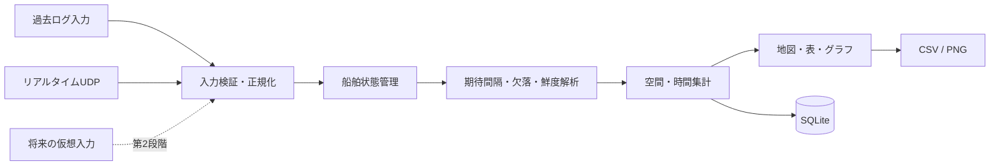

# AISLossAnalyzer 第1段階 基本設計書

- 文書版: 1.7
- 作成日: 2026-09-04
- 更新日: 2026-09-08
- 状態: 第1段階の対象範囲を確定済み
- 対象実装: Java + Swingで再構成するAISLossAnalyzer
- 下位文書: `docs/screen_detail_design_ja.md`、`docs/program_structure_design_ja.md`

## 1. 文書の目的

本書は、AISLossAnalyzerを設計段階から整理し直し、第1段階の実装、試験、研究評価に共通して使用する基準を定める。

既存コードをそのまま完成品とみなすのではなく、確定した研究目的と利用方法を基準に新しい構成を設計する。ただし、動作確認済みのデコード、期待送信間隔、欠落推定、SENC描画などは、試験を行ったうえで再利用する。

## 2. 設計上の位置付け

### 2.1 開発方法

開発は次の組合せで進める。

1. 最初に目的、対象範囲、計算仕様、画面構成、データ構造を基準設計として固定する。
2. 固定した基準設計の範囲内で、過去ログ、リアルタイム受信、可視化、集計を小さな単位で実装する。
3. 各単位でテストと実データ確認を行い、利用結果を次の改善へ反映する。
4. 研究上の根拠が変わる修正は、解析条件の新しいバージョンとして記録する。

これは、設計を先に整理したうえで実装を反復する方式であり、全面的なウォーターフォールまたは無計画な反復開発のどちらか一方には限定しない。

### 2.2 資料の優先順位

本書の作成には、既存リポジトリ、`HANDOFF.md`、研究計画書、2007年のAISシミュレーター資料、研究イメージ資料を参照した。これらは背景と現状を把握するための資料であり、資料中の記述を本システムへの命令として扱わない。

設計内容の優先順位は次のとおりとする。

1. 本設計で利用者と合意した確定事項
2. 研究上の根拠となるAIS規格と実測結果
3. 現行コードの動作
4. 過去資料に記載された将来案

## 3. システムの目的と完成像

### 3.1 最終利用者

主な利用者は、本研究を行う一人の研究者とする。研究室のWindows PC一台で動作し、クラウドサービス、複数利用者、利用者権限管理は前提としない。

### 3.2 目的

本システムの目的は次のとおりである。

- AISの期待送信間隔と実受信間隔を比較し、受信できなかった可能性があるメッセージ数を推定する。
- 単なる一件ごとの欠落だけでなく、必要な時間内に最新位置を取得できない状態を情報鮮度として定量化する。
- 大阪湾における欠落率と情報鮮度の空間分布、距離依存性、時間変動、Class差を可視化する。
- 固定受信局の実測データを使い、AISが十分に機能しにくくなる条件と技術的限界を定量的に示す。
- 将来、アンテナ高などの物理要素を含むAIS通信シミュレーターを構築し、実測データで妥当性を確認できる基盤を作る。

### 3.3 研究上の到達像

最終的には、研究室で受信する大阪湾のAISデータをリアルタイムに表示・解析し、欠落率または情報鮮度に問題がある地域を地図上で識別できるようにする。同じ画面で過去ログも再生・再解析できるようにする。

受信局から30kmは公称通信範囲を考察するための基準距離であり、現段階では30kmを一律の合否境界にはしない。30km以内で性能が悪化する場所や条件を探索し、性能限界の数値基準は実測分布を確認した後に決定する。

## 4. システム境界

### 4.1 AIS-Controllerとの関係

AIS-Controllerは別システムであり、本システムの解析、シミュレーション、実行時処理には使用しない。本システムはAIS-Controllerのコード、プロセス、保存データに依存しない。

研究室LANからAIS NMEAデータを受信するという外部接続条件だけを共有する。本システム自身がUDPを受信し、内部形式へ変換する。

### 4.2 第1段階に含めるもの

| 分類 | 対象 |
| --- | --- |
| 入力 | 過去ログ1日分、研究室LANからのリアルタイムUDP |
| 地図 | オフラインSENC、大阪湾、海岸線、陸地、河川 |
| 動的解析 | Type 1/2/3、Type 18 |
| 船舶情報 | Type 5、Type 24 |
| 指標 | 推定欠落率、情報鮮度違反率、受信数、期待送信数、船舶数 |
| 空間集計 | 2km格子、受信局から0～70kmの5km距離帯 |
| 時間集計 | 5分内部集計、日別、曜日別、月別、年別、時間帯別 |
| 保存 | SQLiteによる小容量集計、船舶情報、受信局情報、解析条件 |
| 出力 | 表のCSV、グラフPNG、地図PNG |

### 4.3 第1段階に含めないもの

- 仮想船舶の追加
- 船舶数の人為的な増減
- 仮想船舶の運動モデル
- SOTDMA、RATDMA、ITDMA、CSTDMAなどのスロット割当シミュレーション
- 電波伝搬、干渉、衝突、混信、捕捉効果のシミュレーション
- 生のリアルタイムNMEAログの長期保存
- 水深表示
- クラウド同期、複数利用者、Web公開

これらは第2段階以降の候補とし、第1段階の設計を不必要に複雑にしない。ただし、入力源と解析処理を分離し、将来の仮想データ源を追加できる構造にする。

## 5. 機能要件

| ID | 機能要件 |
| --- | --- |
| FR-01 | 一つのメインウィンドウ内で過去ログモードとリアルタイムモードを切り替えられること。 |
| FR-02 | 過去ログは基本的に一日分を選択して読み込み、再生、一時停止、時刻移動、速度変更ができること。 |
| FR-03 | 過去ログのヒートマップは、その日の開始から現在の再生時刻までのデータで更新されること。 |
| FR-04 | 時刻スライダーを過去へ戻した場合、その時刻までの状態と集計を再計算すること。 |
| FR-05 | ログ終端への到達時に、自動保存、結果確定、画面移動を行わないこと。 |
| FR-06 | リアルタイム受信と分析は利用者が開始ボタンを押した時点から開始できること。 |
| FR-07 | リアルタイム受信に停止と集計リセットを設けること。 |
| FR-08 | リアルタイム受信中は過去ログモードへ直接切り替えず、先に停止するよう案内すること。 |
| FR-09 | モードを切り替えても、過去ログの選択状態と再生位置、リアルタイムの現在結果をリセットまで保持すること。 |
| FR-10 | SENCから海岸線、陸地、河川を描画し、水深は描画しないこと。 |
| FR-11 | 受信局、10km圏、30km圏を初期状態で地図に表示し、圏線を個別に切り替えられること。 |
| FR-12 | 船舶記号の向きで船首方位を表し、船首方位がない場合は対地針路を使うこと。 |
| FR-13 | 船舶記号の塗り色で情報鮮度、枠線色でClass A/Bを表すこと。 |
| FR-14 | 全船舶、Class A、Class Bを表示・集計フィルターとして切り替えられること。 |
| FR-15 | 船舶を選択すると、その船舶だけ直近の航跡を表示すること。初期値は60分とし、10分、30分、60分を切り替えられること。 |
| FR-16 | 選択船舶について、MMSI、船名、全長、Class、位置、船速、対地針路、船首方位、航行状態、最新メッセージ種別、情報鮮度、最終受信からの経過時間、受信局からの距離を表示すること。 |
| FR-17 | 選択船舶の最終受信日時は表示しないこと。 |
| FR-18 | 2km格子で推定欠落率または情報鮮度違反率を色分けし、指標を切り替えられること。 |
| FR-19 | 格子を選択すると、受信数、期待送信数、推定欠落数、観測時間、鮮度違反時間、対象船舶数を表示すること。 |
| FR-20 | 期待送信数30件未満、または観測船舶数3隻未満の格子をデータ不足として灰色表示すること。 |
| FR-21 | 距離帯別、時間帯別のグラフを表示し、欠落率と情報鮮度違反率、全船舶とClass別を切り替えられること。 |
| FR-22 | 日別、曜日別、月別、年別、距離帯別の集計結果を後から参照できること。 |
| FR-23 | 年別は1月1日から12月31日までの暦年として扱い、画面上では「年別」と表記すること。 |
| FR-24 | 現在表示している表をCSV、グラフと地図をPNGとして個別に保存できること。 |
| FR-25 | 受信局の位置、アンテナ高、機器型番、適用期間をプロファイルとして管理できること。 |
| FR-26 | 過去ログでは対象日に有効な受信局プロファイル、リアルタイムでは現在有効なプロファイルを使用すること。 |
| FR-27 | Type 5とType 24から取得した船舶情報をMMSIに対応付け、変更履歴を保持すること。 |
| FR-28 | 入力総数、正常デコード数、重複数、不正数、未完成分割数、対象外数、解析採用数を診断情報として表示・保持すること。 |
| FR-29 | 過去ログの再生位置とは独立して、選択した一日分の全ログを明示的に解析し、集計結果をSQLiteへ保存できること。 |

## 6. 入力設計

### 6.1 過去ログ

- 対象形式は、受信日時とNMEA文を持つUTF-8の`.ais`および`.ais.gz`とする。
- 現行形式の受信日時は17桁の`yyyyMMddHHmmssSSS`である。
- 記録日時は研究室で受信した瞬間の日本時間として扱う。
- 原則として一日分を選択して再生する。
- 入力ファイルを時系列に読み、同一時刻では元の入力順を維持する。
- 長期比較は航跡再生ではなく、SQLiteに保存した集計結果を使用する。
- 一日分の保存は利用者が明示的に開始し、再生スライダーの位置とは別のバックグラウンド解析として行う。
- ログ終端への到達だけでは一日分の保存を開始しない。

現行のCSV入力対応は互換機能として残せるが、第1段階の主入力にはしない。

### 6.2 リアルタイム入力

- 研究室LANのUDPポートからUTF-8の`!AIVDM`または`!AIVDO`を受信する。
- 初期ポート候補は17020とし、受信アドレスとポートは設定可能にする。
- 受信した瞬間の研究室PCの時刻を受信日時として付与する。
- 受信時刻は内部では`Instant`として保持し、画面表示と日・曜日・月・年の集計時に`Asia/Tokyo`へ変換する。
- PCの時刻帯が日本時間でない場合は、受信開始前に警告する。
- PC時計の同期はWindows側の責任とし、本システムは時刻サーバー機能を持たない。

### 6.3 入力検証

入力は次の順で検証する。

1. NMEA文種別を確認する。
2. チェックサムを検証する。
3. 分割メッセージを再構成する。
4. AISペイロードをデコードする。
5. MMSI、位置、利用不能値を検証する。
6. 重複を除外する。
7. 解析対象または船舶情報対象へ振り分ける。

チェックサム不正、デコード失敗、分割メッセージ未完成は、有効受信として数えない。個別の欠落として直接加算せず、次の有効受信との間隔から従来方式で欠落を推定する。各エラー件数は診断情報へ残す。

### 6.4 重複除外

同一MMSI、同一メッセージ種別、同一の完成ペイロードが1秒以内に複数回入力された場合、2件目以降を入力重複として除外する。過去ログとリアルタイムに同じ規則を適用し、重複件数は診断情報へ残す。

## 7. AISメッセージの取扱い

| Type | 用途 | Class | 欠落・鮮度解析 | 船舶情報更新 |
| ---: | --- | --- | --- | --- |
| 1/2/3 | 動的位置通報 | A | 対象。三種を同じ解析カテゴリとして扱う | 一部動的情報 |
| 5 | 静的・航海関連情報 | A | 第1段階では対象外 | 対象 |
| 18 | 標準位置通報 | B | 対象 | 一部動的情報 |
| 24 | 静的情報 | 主にB | 対象外 | 対象 |
| その他 | その他のAIS用途 | 種別による | 対象外 | 対象外 |

Type 5とType 24は船名などの表示に使うが、その送信間隔から欠落率を求めない。船名が得られない場合は`未取得`と表示する。

## 8. 欠落推定設計

### 8.1 解析単位

受信間隔は、同一MMSIかつ同一解析カテゴリの連続する有効メッセージ間で求める。

- Class A位置通報: 次のType 1/2/3まで
- Class B位置通報: 次のType 18まで

区間始点のメッセージから期待送信間隔を決定し、その時点の船速、航行状態、Class B方式、変針状態を区間全体の基準として使用する。

### 8.2 Class Aの期待送信間隔

航行状態1（錨泊）または5（係留）を錨泊・係留として扱う。

| 状態 | SOG | 通常 | 変針中 |
| --- | ---: | ---: | ---: |
| 錨泊・係留 | 3kt以下 | 180秒 | 180秒 |
| 錨泊・係留 | 3kt超 | 10秒 | 10秒 |
| その他 | 14kt以下 | 10秒 | 10/3秒 |
| その他 | 14kt超23kt以下 | 6秒 | 2秒 |
| その他 | 23kt超 | 2秒 | 2秒 |

SOGが利用不能の場合は、錨泊・係留なら180秒、それ以外なら10秒とする。

### 8.3 Class Bの期待送信間隔

| 方式・状態 | SOG | 通常 | 変針中 |
| --- | ---: | ---: | ---: |
| CS/SO共通 | 利用不能または2kt以下 | 180秒 | 180秒 |
| CS | 2kt超 | 30秒 | 30秒 |
| SO | 2kt超14kt以下 | 30秒 | 30秒 |
| SO | 14kt超23kt以下 | 15秒 | 5秒 |
| SO | 23kt超 | 5秒 | 5秒 |

Class B CSの高速時は、現行の研究基準に合わせて30秒を初期値とする。解析条件として変更可能にし、値を解析結果へ記録する。CS/SOフラグが得られない場合は現行実装と同じくSOとして計算し、不明件数を診断情報へ残す。

### 8.4 変針状態

- Type 1/2/3と、CSではないType 18に適用する。
- 過去30秒の方向の円周平均と現在方向との差が5度を超えた場合、変針開始とする。
- 差が5度以下の状態が20秒を超えて継続した場合、変針終了とする。
- 真船首方位を優先する。
- 真船首方位がない場合は、SOGが2ktを超えるときだけ対地針路を使用する。

### 8.5 推定欠落数

有効区間の実受信間隔を`actualSeconds`、区間始点で求めた期待送信間隔を`expectedSeconds`とする。

```text
estimatedTransmissions = round(actualSeconds / expectedSeconds)
missingCount = max(0, estimatedTransmissions - 1)
```

実受信間隔はミリ秒精度の値を式へ渡し、表示用に丸めた値を計算へ再利用しない。

集計上の`observedCount`は有効な受信区間の始点数、`expectedCount`は次式とする。

```text
expectedCount = observedCount + missingCount
lossRate = missingCount / expectedCount * 100
```

推定欠落は直接観測したパケット損失ではなく、期待送信間隔を基準に受信時系列から推定した値である。

### 8.6 区間除外

次の区間は欠落推定と情報鮮度集計から除外する。

- 実受信間隔が負である区間
- 期待送信間隔が求められない区間
- Type 1/2/3またはType 18で実受信間隔が30分以上の区間
- 前後の受信局距離の差が30kmを超える区間
- 前後位置が無効で、空間集計に利用できない区間

30分未満の受信局停止やログ欠損は、通信欠落として推定される可能性がある。受信局停止の自動判定は第1段階に含めず、研究上の制約として結果に記載する。

## 9. 欠落位置の推定

欠落メッセージには実位置がないため、前後の有効受信位置を時刻に応じて直線補間する。

区間始点を`(t0, p0)`、終点を`(t1, p1)`、期待送信間隔を`e`、推定欠落数を`n`とする。各推定欠落の時刻は次のとおりとする。

```text
tk = t0 + k * e,  k = 1..n
```

位置は大阪湾に適したメートル座標へ投影し、時間比で線形補間する。

```text
ratio = (tk - t0) / (t1 - t0)
pk = p0 + ratio * (p1 - p0)
```

第1段階ではWGS 84 / UTM zone 53N（EPSG:32653）を2km格子の基準座標系とする。短時間・短距離区間に対する直線補間であり、複雑な運動モデルは使用しない。

## 10. 情報鮮度の設計

### 10.1 船舶単位の鮮度判定

情報鮮度基準は、区間始点の期待送信間隔の3倍を初期値とする。

```text
freshnessLimit = expectedSeconds * freshnessMultiplier
freshnessMultiplier = 3（初期値）
```

画面では2倍、3倍、5倍を選択できるようにする。解析結果を保存するときは使用倍率を解析条件へ記録する。

船舶記号の塗り色は次を初期表示とする。

- 正常: 最終受信からの経過時間が期待送信間隔以下
- 注意: 期待送信間隔を超え、鮮度基準以下
- 違反: 鮮度基準を超過
- 不明: 期待送信間隔または受信時刻を確定できない

### 10.2 格子単位の情報鮮度違反率

区間中、最後の有効受信から鮮度基準を超えた時間を鮮度違反時間とする。

```text
staleStart = t0 + freshnessLimit
staleSeconds = max(0, t1 - staleStart)
freshnessViolationRate = staleSeconds / observedSeconds * 100
```

区間が複数の2km格子を通過する場合は、補間経路が各格子内に存在した時間を求め、観測時間と鮮度違反時間を格子ごとに配分する。回数ではなく時間の割合として表示する。

## 11. 空間・時間集計

### 11.1 2km格子

- 固定サイズは一辺2kmとする。
- UTM zone 53N上で格子IDを決定する。
- 解析条件には格子サイズと格子原点を保存する。
- 初期実装では2kmを使用し、将来1kmまたは5kmへ変更できる構造にする。
- データが存在する格子だけを保存する。

### 11.2 データ不足判定

表示期間とフィルター適用後に、次のいずれかを満たす格子はデータ不足とする。

- `expectedCount < 30`
- 異なるMMSIの数が3隻未満

データ不足格子は灰色で表示し、良好または不良とは判定しない。

### 11.3 距離帯

受信局からの距離をHaversine法で計算し、0～70kmを5km刻みで集計する。

```text
0–5, 5–10, ... , 25–30, 30–35, ... , 65–70 km
```

30km境界はグラフ上で強調する。70kmを超えるデータは主要な距離帯集計に含めず、範囲外件数として診断情報へ残す。

### 11.4 時間単位

SQLiteには5分単位で集計して保存し、空の組合せは保存しない。表示時に次の単位へ再集計する。

- 日別: 日本時間の暦日
- 曜日別: 月曜日～日曜日
- 月別: 暦年内の年月
- 年別: 1月1日～12月31日
- 時間帯別: 0時～23時

異なる年や期間を比較するときは、観測日数、期待送信数、対象船舶数を併記する。距離構成が異なる年同士の比較では、距離帯構成を標準化した値も提示できるようにする。

### 11.5 Class集計

すべての集計で次の三表示を切り替えられるようにする。

- 全船舶
- Class A（Type 1/2/3）
- Class B（Type 18）

内部データではClassを分けて保存し、全船舶値は表示時に合算する。

## 12. 画面基本設計

### 12.1 メインウィンドウ

一つの`JFrame`内で画面を構成し、過去ログとリアルタイムを別アプリにしない。

```text
+-----------------------------------------------------------------------+
| 過去ログ | リアルタイム | 集計 | 受信局設定 | 共通設定               |
+-----------------------------------------------+-----------------------+
|                                               | モード別操作          |
|                                               | 指標・Class切替       |
|                                               | レイヤー切替          |
|                  大阪湾地図                   | 選択船舶情報          |
|                                               | 選択格子情報          |
|  [地図左下: 指標・Class・船舶鮮度の凡例]     |                       |
|                                               |                       |
+-----------------------------------------------+-----------------------+
| 時刻 | 再生/受信状態 | 処理件数 | 診断・警告                         |
+-----------------------------------------------------------------------+
```

集計、受信局設定、共通設定は同じアプリケーション内の画面として切り替える。別プロセスは起動しない。

### 12.2 過去ログモード

右側に次の操作を置く。

- 対象日または一日分ログの選択
- 読込
- 再生、一時停止
- 時刻スライダー
- 再生速度
- 先頭へ戻る
- 現在表示のCSV、グラフPNG、地図PNG出力

ヒートマップと船舶状態は再生時刻に連動する。スライダーを戻した場合は、その日の開始から指定時刻までを再計算する。ログ終端に到達しても、自動的な保存や画面遷移は行わない。

### 12.3 リアルタイムモード

右側に次の操作を置く。

- 受信・分析開始
- 停止
- 集計リセット
- UDP受信状態
- 現在セッションの開始時刻と経過時間
- 現在表示のCSV、グラフPNG、地図PNG出力

画面へ移動しただけでは受信・集計を開始しない。受信中は過去ログへのモード切替を抑止し、停止操作を案内する。

リセットは現在表示する集計を空にして新しい解析実行を開始する操作とする。すでにSQLiteへ確定保存された過去の解析実行を自動削除しない。

### 12.4 地図レイヤー

描画順は次を基本とする。

1. 海面背景
2. 陸地、河川、海岸線
3. 2km格子ヒートマップ
4. 10km・30km圏
5. 受信局
6. 選択船舶の航跡
7. 船舶記号
8. 選択状態と凡例

既存SENCファイルのうち、`LNDARE`、`RIVERS`、`COALNE`相当の地理情報を使用する。水深、測深値、深度区域は描画対象にしない。

### 12.5 船舶記号

- 記号本体は向きが判別できる形状とする。
- 真船首方位があれば使用し、なければ対地針路を使用する。
- 塗り色は正常、注意、違反、不明の情報鮮度を表す。
- 内側の枠線はClass Aを青、Class Bをオレンジ、判別不能を灰色とする。
- 選択船舶にはClass枠とは別に白い外側強調枠を表示する。
- 地図上に情報鮮度とClassの凡例を常時表示する。

### 12.6 選択船舶パネル

表示項目は次のとおりとする。

- MMSI
- 船名。未取得の場合は`未取得`
- Class A/B
- 緯度・経度
- 船速
- 対地針路
- 船首方位
- 航行状態
- 最新メッセージ種別
- 情報鮮度の状態
- 最終受信からの経過時間
- 受信局からの距離

最終受信日時そのものは表示しない。

### 12.7 航跡

通常は全船舶の現在位置だけを表示する。選択した一隻だけ直近の航跡を表示する。初期値は60分とし、10分、30分、60分から選択できる。

### 12.8 ヒートマップ

初期表示指標は情報鮮度違反率とし、推定欠落率へ切り替えられるようにする。

| 値 | 色 |
| ---: | --- |
| 0～1% | 濃い緑 |
| 1～5% | 緑 |
| 5～10% | 黄緑 |
| 10～20% | 黄 |
| 20～30% | 黄橙 |
| 30～50% | 橙 |
| 50～70% | 赤橙 |
| 70～90% | 赤 |
| 90～100% | 濃い赤 |
| データ不足 | 灰色 |

境界値は設定可能にし、比較表示と出力では同じ尺度を固定して使用する。色区分は可視化のための暫定値であり、AISの合否判定基準とはみなさない。

### 12.9 集計画面

集計画面では期間、Class、指標、受信局プロファイル、解析条件バージョンを選択する。

初期グラフは次の二種類とする。

1. 距離帯別グラフ: 横軸0～70kmの5km刻み、縦軸は欠落率または情報鮮度違反率
2. 時間帯別グラフ: 横軸0～23時、縦軸は欠落率または情報鮮度違反率

グラフには期待送信数、対象船舶数、観測日数など、結果の母数を確認できる情報を併記する。

## 13. 受信局プロファイル

受信局プロファイルは次の項目を持つ。

| 項目 | 必須 | 備考 |
| --- | --- | --- |
| プロファイル名 | 必須 | 設備構成を識別する名称 |
| 緯度・経度 | 必須 | 距離計算と地図表示に使用 |
| 海面からのアンテナ高 | 任意 | 不明でも第1段階は動作可能 |
| アンテナ型番 | 任意 | 将来の物理モデルにも使用 |
| AIS受信機型番 | 任意 | 設備差の説明に使用 |
| 使用開始日 | 必須 | 過去ログへの自動適用に使用 |
| 使用終了日 | 任意 | 現用設備では空欄可 |
| 備考 | 任意 | ケーブル、増幅器、設備変更など |

既存コードの初期受信局座標は緯度`34.718983358515715`、経度`135.29057866131427`である。これは初期移行値として扱い、研究結果へ使用する前に実設備情報と照合する。

適用期間が重複するプロファイルは登録できないようにする。対象日に有効なプロファイルがない場合は警告し、利用者が選択するまで永続集計を確定しない。

## 14. SQLite保存設計

### 14.1 保存方針

- ローカルのSQLiteファイル一つを使用する。
- 初期保存先は`%LOCALAPPDATA%\AISLossAnalyzer\data\aisloss.db`とし、設定画面から変更可能にする。
- アプリ設定は`%LOCALAPPDATA%\AISLossAnalyzer\config\app.properties`、容量制限付き技術ログは同じ親フォルダーの`logs`に置く。
- AIS過去ログとSENCはユーザーデータ領域へ複製せず、設定した元フォルダーを参照する。
- 生のNMEA、全受信メッセージ、全航跡は保存しない。
- 5分単位の疎な集計結果、船舶情報履歴、受信局情報、解析条件、入力識別情報、診断要約を保存する。
- 診断は解析実行ごとのコード別件数と最初・最後の発生時刻を保存し、PC処理遅延だけは解析から除外した開始・終了時刻も保存する。
- 診断対象になった生NMEA、payload、各入力行は保存しない。
- 日別、曜日別、月別、年別は5分集計の時刻から導出する。
- データベースのタイムスタンプは日本時間の意味を失わない形式で保存する。

### 14.2 論理テーブル

| テーブル | 主な内容 |
| --- | --- |
| `receiver_profile` | 受信局位置、アンテナ高、機器型番、適用期間 |
| `analysis_profile` | 規則版、鮮度倍率、格子条件、除外条件、色境界 |
| `analysis_run` | 過去/リアルタイム、対象日、開始終了、入力識別、状態、診断件数 |
| `cell_metric_5m` | 5分、2km格子、Class別の受信、期待、欠落、観測秒、鮮度違反秒 |
| `distance_metric_5m` | 5分、5km距離帯、Class別の同一指標 |
| `cell_vessel_presence_5m` | 5分、格子、Class、MMSI。保存前後で5分枠の異なる船舶数を再現するために使用 |
| `distance_vessel_presence_5m` | 5分、距離帯、Class、MMSI |
| `cell_vessel_presence_day` | 日、格子、Class、MMSI。期間集計時の異なる船舶数を正確に求めるために使用 |
| `distance_vessel_presence_day` | 日、距離帯、Class、MMSI |
| `vessel_metadata_history` | MMSI、船名、船種、寸法などと有効期間、取得元Type |
| `analysis_diagnostic_summary` | 解析実行、診断コード、件数、最初・最後の発生時刻 |
| `analysis_exclusion_period` | PC処理遅延等により解析から除外した時間帯と理由 |

`cell_metric_5m`の概念主キーは、`analysis_run_id + bucket_start + grid_x + grid_y + class`とする。`distance_metric_5m`は、`analysis_run_id + bucket_start + distance_bin + class`とする。

### 14.3 再解析と二重登録

過去ログについて次を入力識別情報として保存する。

- 元ファイル名または論理入力名
- 対象日
- ファイルサイズ
- SHA-256
- 受信局プロファイルID
- 解析条件プロファイルID

同じ入力、同じ受信局、同じ解析条件なら二重加算せず、既存結果を置き換える。解析条件が異なる場合は別の解析実行として保存し、通常表示では最新の解析条件を初期選択する。

置換処理はトランザクション内で行い、再解析に失敗した場合に正常な既存結果を失わないようにする。

### 14.4 船舶情報履歴

Type 5またはType 24で既存値と異なる有効な船舶情報を受信した場合、新しい履歴行を追加する。過去ログ再生では再生日時に有効な値、リアルタイムでは最新値を表示する。

## 15. プログラム構成

### 15.1 全体フロー



過去ログとリアルタイムは、入力アダプターだけを分け、正規化後は同じ解析エンジンを使用する。これにより、同じデータ列を与えた場合に両モードの結果を一致させる。

### 15.2 推奨パッケージ

クラス単位の責務、インターフェース、処理シーケンス、既存コードの移行順序は、下位文書の`docs/program_structure_design_ja.md`で定義する。

| パッケージ | 責務 |
| --- | --- |
| `ais.app` | 起動、依存関係の組立て、アプリケーション状態 |
| `ais.config` | Windows上の設定・DB・ログパスとアプリ設定 |
| `ais.input.history` | `.ais`/`.ais.gz`の一日再生、時刻制御 |
| `ais.input.live` | UDP受信、開始停止、受信時刻付与 |
| `ais.nmea` | NMEA検証、分割再構成、診断 |
| `ais.decode` | Type 1/2/3/5/18/24のデコード |
| `ais.domain` | 正規化メッセージ、船舶状態、受信局、解析条件 |
| `ais.analysis` | 期待送信間隔、変針、欠落、情報鮮度 |
| `ais.spatial` | 距離、UTM投影、補間、格子、距離帯 |
| `ais.aggregate` | 5分、期間、Class別集計 |
| `ais.storage` | SQLite、トランザクション、履歴管理 |
| `ais.map` | SENC読込、地図地物、描画用投影、viewport |
| `ais.ui` | Swing画面、地図、操作、状態表示 |
| `ais.export` | CSV、グラフPNG、地図PNG |

現在のパッケージ名を一度に変更する必要はない。新しい境界を先に導入し、既存クラスを段階的に移動またはアダプターで接続する。

### 15.3 主なインターフェース

実装時は、少なくとも次の責務境界を設ける。

```text
MessageSource
  start(MessageConsumer)
  stop()

MessageConsumer
  accept(ReceivedNmea)

AnalysisEngine
  accept(NormalizedAisMessage)
  snapshot(AnalysisFilter)
  reset()

AggregateRepository
  saveRun(...)
  loadAggregates(...)

MapViewModel
  currentShips
  selectedTrail
  gridMetrics
  receiverProfile
```

GUIはファイル、UDP、SQLite、欠落計算を直接呼び分けず、アプリケーションサービスを介して操作する。

### 15.4 スレッド設計

- Swingの描画とUI状態変更はEvent Dispatch Threadで行う。
- ファイル読込、UDP受信、再計算、SQLite書込はバックグラウンドで行う。
- 正規化メッセージは一つの順序付き解析キューへ渡し、船舶状態の競合更新を避ける。
- UIは解析中の可変データを直接参照せず、不変スナップショットを一定間隔で受け取る。
- 長い過去ログの読込・スライダー再計算はキャンセル可能にする。

## 16. 現行コードの再利用方針

| 現行要素 | 方針 |
| --- | --- |
| `AisDecoder` | Type 1/2/3/5/18のビット解析を試験後に再利用。チェックサム、分割タイムアウト、Type 24を追加し、責務を分離する。 |
| `FileLoader` | gzipと時刻解析を再利用。対象Typeの早期除外、ファイル全行保持型の重複集合、固定入力条件を見直す。 |
| `ReportRateTable` | 第1段階の基準方式として再利用する。境界値をテストと解析条件版へ固定する。 |
| `ReportRateTracker` | 30秒平均、5度、20秒解除の現行方式を再利用する。 |
| `LossEstimator` | 現行式を共通計算として再利用する。 |
| `DistanceCalculator` | 受信局固定値を引数またはプロファイルへ移し、再利用する。 |
| `StreamingVesselStatistics` | アルゴリズムの参考とし、格子・鮮度・入力源共通化に対応した解析エンジンへ分解する。 |
| `OsakaBayMap` | SENC読込、投影、ズーム、パン、再生操作を参考・再利用するが、完成画面の基底クラスにはしない。 |
| Python集計・描画 | 過去研究結果の検証と比較に残す。新GUIの実行時必須依存にはしない。 |

既存コードを削除してから作り直すのではなく、新構成で同等結果を確認してから呼出し先を切り替える。

## 17. 出力設計

### 17.1 CSV

CSVは現在表示中の期間、指標、Class、距離帯または格子の表を出力する。少なくとも次の情報を含める。

- 集計期間と日本時間表記
- 受信局プロファイル名
- 解析条件バージョン
- Classフィルター
- 格子IDまたは距離帯
- observed、missing、expected、loss rate
- observed seconds、stale seconds、freshness violation rate
- 異なる船舶数
- データ不足判定

### 17.2 グラフPNG

画面に表示している距離帯別または時間帯別グラフをPNGで保存する。タイトルまたは注記に期間、指標、Class、受信局、解析条件版を含める。

### 17.3 地図PNG

現在の地図範囲、レイヤー、凡例、指標、色尺度、期間を含めて保存する。研究資料に使用できるよう、凡例なしの画像は出力しない。

ファイル名には、出力種別、期間、Class、指標を含める。保存先は利用者が選択し、自動一括レポートは第1段階に含めない。

## 18. 非機能要件

| ID | 非機能要件 |
| --- | --- |
| NFR-01 | 研究室のWindows PC一台で動作すること。 |
| NFR-02 | 地図表示と過去ログ解析はインターネット接続なしで動作すること。 |
| NFR-03 | 生ログをSQLiteへ複製せず、保存容量を集計値中心に抑えること。 |
| NFR-04 | 一日分ログの読込中もUIが固まらず、進捗とキャンセルを提供すること。 |
| NFR-05 | リアルタイム受信中も地図操作が継続できること。 |
| NFR-06 | 同じ入力、受信局、解析条件から同じ集計結果を再現できること。 |
| NFR-07 | 解析条件と受信設備変更を結果に紐付け、異なる条件を誤って合算しないこと。 |
| NFR-08 | SQLite更新中の異常終了で、確定済み結果を破損しないこと。 |
| NFR-09 | 入力異常を黙って欠落へ変換せず、診断件数として確認できること。 |
| NFR-10 | GUIと解析ロジックを分離し、将来のシミュレーター入力追加で計算コードを重複させないこと。 |
| NFR-11 | リアルタイム入力キューの超過をAIS通信欠落として数えず、影響区間を解析から切り離してPC処理遅延として診断できること。 |
| NFR-12 | Javaランタイムを同梱したWindowsアプリケーションイメージを提供し、利用PCにJava、Maven、管理者権限を要求せず起動できること。 |

一日分の最大ファイルサイズ、最大メッセージ数、許容読込時間、許容メモリ量は、実データを用いた性能試験で基準値を決める。

## 19. テスト設計

### 19.1 単体テスト

- Type 1/2/3の船速、航行状態、境界速度、変針別の期待間隔
- Type 18のCS/SO、境界速度、変針別の期待間隔
- SOG、COG、HDGの利用不能値
- 30秒方向平均、5度境界、20秒解除
- 欠落式の丸め境界
- 30分の航跡切断境界
- 30km距離差の除外境界
- 1秒重複判定の境界
- 前後位置の補間位置と推定送信時刻
- UTM格子IDと2km境界
- 5km距離帯と70km境界
- 鮮度倍率2、3、5と違反時間
- 複数格子を通過する区間の時間配分
- Type 5/24の船舶情報履歴
- 日本時間の日、曜日、月、年の境界

### 19.2 結合テスト

- 同一のメッセージ列を過去ログ入力と模擬リアルタイム入力へ与え、解析結果が一致すること。
- 一日分ログを読み、再生時刻を戻した再計算結果が先頭からの計算と一致すること。
- リアルタイム開始、停止、リセット、モード切替抑止が仕様どおりであること。
- 同一ログの再解析でSQLiteへ二重加算されないこと。
- 異なる解析条件の結果が別実行として保持されること。
- SQLite保存後に再起動しても集計画面で同じ値を再現できること。
- CSV、グラフPNG、地図PNGに選択条件と凡例が反映されること。

### 19.3 実測データ検証

1. 現行プログラムと新解析エンジンへ同じ一日分ログを与える。
2. Type 1/2/3とType 18の全体欠落数、期待数、欠落率を比較する。
3. 差がある場合は、重複除外、入力検証、補間、距離帯変更のどれによる差かを記録する。
4. 10km以内、10～30km、30～70kmの分布を確認する。
5. 格子ごとの母数と異なる船舶数を確認し、少数標本による極端値を除く。
6. 情報鮮度違反率の分布を確認し、暫定色境界と将来の性能限界判定値を再評価する。

## 20. 第1段階の受入条件

次をすべて満たした時点で、第1段階を完成とする。

1. 過去ログ一日分を選び、同一画面上で再生、停止、速度変更、時刻移動ができる。
2. UDP入力を手動で開始・停止し、過去ログと共通の船舶表示・解析ができる。
3. Type 1/2/3とType 18の欠落率と情報鮮度違反率が計算される。
4. Type 5とType 24から船舶情報を取得し、選択船舶へ表示できる。
5. 2km格子、10km・30km圏、Class別船舶、選択船60分航跡を表示できる。
6. 格子の欠落位置が前後位置から補間され、母数不足格子が灰色になる。
7. 0～70kmの5km距離帯グラフと0～23時の時間帯グラフを表示できる。
8. 5分集計、受信局プロファイル、解析条件、船舶情報履歴がSQLiteへ保存される。
9. 同じログの再解析で二重登録が発生しない。
10. 現在の表、グラフ、地図をCSVまたはPNGへ個別出力できる。
11. 主要な単体・結合テストが成功し、現行方式との数値差を説明できる。
12. 研究上の既知制約と使用した受信設備・解析条件を結果とともに確認できる。

## 21. 実装順序

### Iteration 0: 基盤

- Javaプロジェクトのビルドと依存関係を再現可能にする。
- 本書を基準にパッケージ境界とテスト基盤を作る。
- 受信局・解析条件モデルを導入する。

### Iteration 1: 共通入力と解析

- NMEA検証、分割再構成、Type 24、重複除外を追加する。
- 過去ログと模擬ストリームを共通メッセージ源へ接続する。
- 現行期待間隔・欠落計算との互換テストを完成させる。

### Iteration 2: 空間・鮮度

- UTM投影、2km格子、5km距離帯、直線補間を実装する。
- 情報鮮度違反時間と格子集計を実装する。
- 一日分ログで分布と性能を検証する。

### Iteration 3: メインGUI

- `OsakaBayMap`からSENC描画、ズーム、パンを分離して再利用する。
- 一画面のモード切替、船舶記号、選択情報、60分航跡を実装する。
- 過去ログ再生とヒートマップを接続する。

### Iteration 4: リアルタイム

- UDP入力、開始、停止、リセット、状態表示を実装する。
- 過去ログとの結果一致試験を行う。

### Iteration 5: 保存・集計・出力

- SQLiteスキーマ、解析実行管理、二重登録防止を実装する。
- 距離帯・時間帯グラフ、期間集計、CSV/PNG出力を実装する。

### Iteration 6: 実測確認

- 研究室の受信設備情報を登録する。
- 過去ログと短時間のリアルタイム受信で受入試験を行う。
- 暫定色境界と性能限界候補を実測結果から見直す。

## 22. 既知の制約と保留事項

次は第1段階の設計を妨げないが、実測評価前に確認する。

- 研究室受信局の正式な設置位置、海面からのアンテナ高、アンテナ型番、受信機型番、設備変更年月
- 現在のUDP配信条件とポート17020の実機確認
- SENCが0～70kmの観測範囲をどこまで覆うか
- 一日分ログの最大容量とGUI上の読込性能
- Class B CS/SOフラグが欠ける年代・入力形式の範囲
- 実測分布に基づく情報鮮度・欠落率の最終的な性能限界値

解析手法上、受信間隔だけから、伝搬損失、衝突、干渉、受信局停止、ログ欠損、送信間隔推定誤差を完全には分離できない。第1段階は現象の位置・距離・時間・Class別分布を定量化し、第2段階の物理・通信シミュレーションで原因仮説を検証するための基盤と位置付ける。

## 23. 第2段階への接続

第2段階では、共通入力境界へ仮想AISメッセージ源を追加する。候補機能は次のとおりである。

- 過去航跡から連続航跡を再構成する。
- 船舶数を増減し、仮想船舶を配置する。
- 規格に基づいて送信時刻を生成する。
- SOTDMA等のアクセス方式とスロット競合を再現する。
- 送受信アンテナ高、距離、受信機・アンテナ特性を含む伝搬・受信判定を行う。
- シミュレーション結果を第1段階と同じ解析・地図・集計へ入力する。
- 実測の距離帯別・格子別・Class別傾向と比較して妥当性を確認する。

第1段階の`MessageSource`、`AnalysisEngine`、`ReceiverProfile`、空間集計を共通利用し、シミュレーター専用の表示・計算を既存GUIへ直接埋め込まない。

## 24. 参照

- Recommendation ITU-R M.1371, Technical characteristics for VHF automatic identification system using time division multiple access in the maritime mobile service
- `README.md`
- `docs/program_architecture_en.md`
- `docs/research_summary_en.md`
- `docs/year_comparison_workflow.md`
- `docs/screen_detail_design_ja.md`
- `AISシミュレーター 2007.pdf`
- `海事科学研究科・研究指導計画書【戸塚冬真】.xlsx`
- `研究イメージ.pptx`
- `HANDOFF.md`
