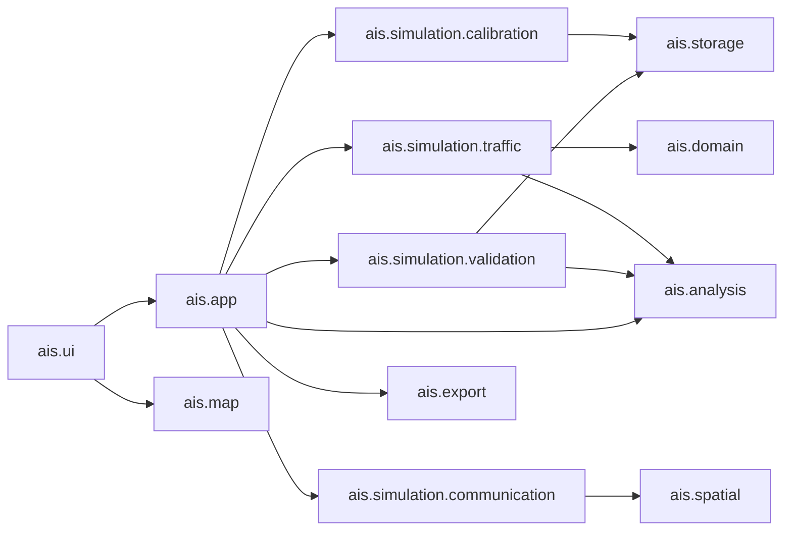

# AIS通信モデル プログラム構成設計書

- 文書版: 1.1（確定版・上位文書v2.0反映）
- 作成日: 2026-10-06
- 対象: CM-E1初期モデル、シミュレーション再生、初期妥当性確認
- 上位文書: `docs/communication_model_spec_ja.md` v2.0
- 既存構成: `docs/program_structure_design_ja.md`
- 状態: 確定
- 確定日: 2026-10-06

## 1. 目的と範囲

本書は、通信モデル仕様書で確定したCM-E1を、Javaクラス、パッケージ、SQLiteテーブル、処理の受け渡し、スレッド境界、テストへ落とし込む。

初回実装の対象は次のとおりとする。

1. 保存済み実測集計からCM-E1パラメータを試算する。
2. 内容確認後に、版付き通信モデルとしてSQLiteへ保存する。
3. 過去ログから理想送信列を再構成する。
4. 距離帯×Class別確率で受信・欠落・適用外を判定する。
5. 受信成功イベントだけを既存解析エンジンへ入力する。
6. 地図上でシミュレーション位置と最終受信位置を再生する。
7. 検証期間を30回実行し、実測と距離なし基準モデルを比較する。

CM-E2、CM-E3、アンテナ高を用いるCM-P1、スロット競合を扱うCM-N1は、拡張可能な境界だけを用意し、初回実装へ混在させない。

上位仕様書v2.0で追加したS6「大阪湾交通モデル・仮想船舶生成」、S7「CM-N1・通信混雑モデル」、S8「限界点評価」は本書のS1～S5完了後の対象とする。S6～S8のクラス・保存・画面構成は、交通生成方法とCM-N1詳細の確定後に別版のプログラム構成設計として追加する。

## 2. 設計方針

### 2.1 モジュラーモノリスを維持する

既存と同じ一つのJavaプロセスで動作させる。通信モデルのために別サーバー、別DB、別言語の実行環境は追加しない。

- Swingは画面表示と利用者操作だけを担当する。
- `ais.app`はユースケース、非同期実行、状態遷移を担当する。
- `ais.simulation.*`は理想送信、通信判定、検証計算を担当する。
- `ais.analysis`は実測・シミュレーション共通の欠落・鮮度計算を担当する。
- `ais.storage`はSQLiteを担当する。
- `ais.export`はCSV・PNG出力を担当する。

### 2.2 シミュレーションは正規化イベント境界へ接続する

既存の`MessageSource`は、生NMEA文を`AisInputPipeline`へ渡す入力境界である。CM-E1はすでにデコード済みの航跡から理想送信を作るため、偽のNMEA文を生成して再デコードしない。

通信モデルで受信成功した送信予定を`PositionReport`へ変換し、`AnalysisEngine.accept(NormalizedAisEvent)`へ直接渡す。

```text
過去AISログ
    ↓ HistoricalReplayLoader（既存）
NormalizedAisEvent一覧
    ↓ IdealTransmissionGenerator（新規）
IdealTransmission一覧
    ↓ CommunicationModel（新規）
ReceptionDecision
    ↓ RECEIVEDだけPositionReportへ変換
AnalysisEngine（既存）
    ↓
推定欠落・情報鮮度・距離帯・格子集計
```

この構成では、NMEA解析のテストをシミュレーションごとに繰り返さず、実測とシミュレーションの評価ロジックを共通化できる。

### 2.3 日付をコードへ固定しない

2025年11月学習、12月検証は初期研究条件であり、クラス定数やSQLへ固定しない。学習期間、検証期間、除外日はリクエスト値と保存済みモデルのメタデータで管理する。

将来は複数月学習、月単位交差検証、未使用期間による最終検証を、同じサービスと保存構造で実行できるようにする。

### 2.4 保存量を増やしすぎない

30回検証の全送信判定や全2km格子をSQLiteへ保存しない。保存対象はモデルパラメータ、実行条件、距離帯×Class別の分子・分母、比較結果に必要な診断値とする。

一日再生中の真位置、最終受信位置、送信判定履歴はメモリ上に保持し、利用者が要求したPNG・CSVだけを出力する。

## 3. 全体構成



依存規則は次のとおりとする。

- `ais.simulation.communication`はSwing、JDBC、ファイル選択を参照しない。
- `ais.simulation.traffic`はSQLiteへ直接アクセスしない。
- `ais.simulation.validation`は画面用コンポーネントを参照しない。
- `ais.storage`は通信モデルの計算式を持たない。
- `ais.ui`は確率計算、乱数生成、ブートストラップを実行しない。
- `ais.analysis`は特定のCM-E1実装を参照しない。

## 4. 追加パッケージ

```text
src/main/java/ais/
  simulation/
    calibration/
    traffic/
    communication/
    validation/
  app/
  storage/
  ui/
  ui/viewmodel/
  export/
```

| パッケージ | 責務 |
| --- | --- |
| `ais.simulation.calibration` | 実測集計からパラメータ、信頼区間、採用可否を計算 |
| `ais.simulation.traffic` | 実受信点から理想送信予定とシミュレーション上の位置を再構成 |
| `ais.simulation.communication` | パラメータ検索、決定論的乱数、受信・欠落・適用外判定 |
| `ais.simulation.validation` | 反復実行、距離なし基準モデル、実測比較、誤差集計 |
| `ais.app` | モデル作成、再生、検証のユースケースと非同期状態管理 |
| `ais.storage` | モデル、入力run、実験、距離帯結果の永続化 |
| `ais.ui` | モデル作成、妥当性確認、シミュレーション再生画面 |
| `ais.export` | モデルパラメータと妥当性結果のCSV・PNG |

## 5. 共通データ型

### 5.1 `ais.simulation.calibration`

| 型 | 種類 | 主な値・責務 |
| --- | --- | --- |
| `CommunicationModelId` | record | UUID形式のモデルID |
| `CommunicationModelCode` | enum | `CM_E1`、将来`CM_E2`等 |
| `CommunicationModelDefinition` | record | ID、版、学習期間、受信局、解析条件、作成日時、説明 |
| `CommunicationTrainingRequest` | record | モデル種別、期間、除外日、受信局ID、解析条件ID、ブートストラップ条件 |
| `CalibrationDayRow` | record | 日、距離帯、Class、observed、missing、MMSI集合または数 |
| `CommunicationParameterKey` | record | 距離帯index、Class |
| `CommunicationParameter` | record | 分子・分母、生の率、補正確率、信頼区間、標本情報、適用状態 |
| `ParameterApplicability` | enum | `DIRECT`、`INTERPOLATED`、`OUT_OF_MODEL` |
| `CommunicationModelDraft` | record | 保存前の定義候補、全パラメータ、警告、参照run ID |
| `ConfidenceInterval` | record | 下限、上限、幅 |

確率は内部では`0.0～1.0`で保持し、画面とCSVだけを百分率表示にする。

### 5.2 `ais.simulation.traffic`

| 型 | 種類 | 主な値・責務 |
| --- | --- | --- |
| `IdealTransmission` | record | 送信予定ID、送信予定時刻、MMSI、Class、Type、位置、SOG等、生成元 |
| `IdealTransmissionId` | record | 入力日、MMSI、Class、送信時刻、同時刻ordinalから一意化 |
| `TransmissionOrigin` | enum | `OBSERVED_ANCHOR`、`INTERPOLATED` |
| `IdealTransmissionDay` | record | 対象日、入力fingerprint、理想送信一覧、メタデータ更新、診断 |
| `SimulationTruthState` | record | シミュレーション上の位置、向き、時刻、航跡 |

`IdealTransmission`を`PositionReport`のサブクラスにはしない。送信前はまだ受信されていないため、`receivedAt`を持つ`PositionReport`と意味を分ける。

### 5.3 `ais.simulation.communication`

| 型 | 種類 | 主な値・責務 |
| --- | --- | --- |
| `CommunicationModel` | interface | 1件の理想送信について受信判定を返す |
| `EmpiricalDistanceClassModel` | class | CM-E1の距離帯×Class確率判定 |
| `ClassOnlyBaselineModel` | class | 距離を使わない比較用モデル |
| `ReceptionContext` | record | 受信局、モデルID、実行seed、必要な将来状態 |
| `ReceptionDecision` | record | 結果、適用確率、パラメータキー、適用方法、乱数値 |
| `ReceptionOutcome` | enum | `RECEIVED`、`LOST`、`OUT_OF_MODEL` |
| `DeterministicUniformSource` | class | seedと送信予定IDから0～1の再現可能な値を生成 |
| `CommunicationParameterLookup` | class | 直接値、補間値、適用外を検索 |

`CommunicationModel`の契約は次のとおりとする。

```java
public interface CommunicationModel {
    ReceptionDecision decide(
            IdealTransmission transmission,
            ReceptionContext context);
}
```

### 5.4 `ais.simulation.validation`

| 型 | 種類 | 主な値・責務 |
| --- | --- | --- |
| `ValidationRequest` | record | モデルID、検証期間、除外日、反復回数、seed一覧 |
| `ValidationExperimentId` | record | 一回の検証実験ID |
| `ValidationRunResult` | record | iteration、seed、モデル種別、距離帯別集計、診断 |
| `ValidationCellResult` | record | 距離帯、Class、実測、平均、変動範囲、誤差、判定 |
| `ValidationSummary` | record | CM-E1と基準モデルの重み付きMAE、改善率、傾向判定 |
| `ValidationStatus` | enum | `IDLE`、`RUNNING`、`CANCELLING`、`COMPLETE`、`FAILED` |

## 6. モデル作成処理

### 6.1 アプリケーションサービス

`CommunicationModelService`を`ais.app`へ追加する。

```java
public final class CommunicationModelService implements AutoCloseable {
    CompletableFuture<CommunicationModelDraft> preview(
            CommunicationTrainingRequest request);

    CompletableFuture<CommunicationModelDefinition> save(
            CommunicationModelDraft draft,
            String name,
            String notes);

    CompletableFuture<List<CommunicationModelDefinition>> findAll();

    CompletableFuture<CommunicationModelDraft> load(
            CommunicationModelId id);
}
```

`preview`はDBを変更しない。`save`は、preview後の入力runが現在も同じかを確認し、一つのSQLiteトランザクションでモデル、除外日、参照run、全パラメータを保存する。

保存済みモデルの更新APIは設けない。条件変更時は新しいモデルIDと版を作る。

### 6.2 パラメータ作成クラス

| クラス | 責務 |
| --- | --- |
| `CommunicationModelTrainer` | 日別行から全距離帯×Classのdraftを統括生成 |
| `PooledRateEstimator` | 期間内の分子・分母を合算し、生の率とJeffreys補正値を計算 |
| `DayBlockBootstrap` | 日単位再標本化による95%信頼区間を計算 |
| `ParameterEligibilityPolicy` | expected、MMSI、日数、信頼区間幅から直接採用可否を判定 |
| `DistanceParameterInterpolator` | 同一Classの両側直接採用セルだけで線形補間 |
| `ModelWarningFactory` | 未解析日、設備期間不一致、データ不足、適用外等を警告化 |

ブートストラップ反復数とseedは`CommunicationTrainingRequest`へ持たせ、モデルとともに保存する。画面既定値は後続確認で決定し、コード内部の変更不能な値にしない。

### 6.3 SQL入力

新規`CommunicationCalibrationRepository`は、既存のactiveかつCOMPLETEな解析runだけを対象にする。

- `distance_metric_5m`を日、距離帯、Class単位に合算する。
- `distance_vessel_presence_day`から期間内の異なるMMSI数を取得する。
- 対象日の`analysis_run.id`を返し、モデルの根拠runとして保存する。
- 受信局ID、解析条件ID、学習期間、除外日をSQL条件へ含める。
- 日別行をJavaへ返し、Jeffreys補正、ブートストラップ、補間はJavaで行う。

率だけをSQLから返さず、observed、missing、日、MMSI数を返す。

### 6.4 モデル版

版番号は同じ`model_code`、受信局プロファイル、解析条件の組合せ内で、保存時にSQLiteトランザクション中で採番する。

初期学習期間を拡大した場合も既存モデルを上書きせず、新しい版を作る。初期11月モデルと複数月モデルを同時に比較できるようにする。

## 7. 理想送信列の生成

### 7.1 `IdealTransmissionGenerator`

`HistoricalReplayDataset.events()`からType 1/2/3/18だけを取り出し、MMSIとClass単位で時系列処理する。Type 1/2/3は同じClass A位置報告系列として扱う。

連続する実受信点`t0`、`t1`について次を行う。

1. `t0`の状態から既存`SpecificationReportRatePolicy`で期待送信間隔を求める。
2. 既存`IntervalEvaluator`と同じ30分、30km、無効位置規則を確認する。
3. 現在の`LossEstimator`と同じ丸め規則で、挿入する送信数を決める。
4. 既存`MissingPositionEstimator`または`TrackInterpolator`を再利用してUTM 53N上の位置を補間する。
5. 挿入イベントは`t0`のSOG、航行状態、変針状態、メッセージ種別を引き継ぐ。
6. 観測anchorと挿入送信を全船舶で時刻順にマージする。

生成後の一意順は次で固定する。

```text
送信予定時刻 → MMSI → Class → OBSERVED_ANCHORを先 → ordinal
```

これにより、入力ファイル順やHashMap走査順で乱数結果が変わらないようにする。

### 7.2 Type 5/24

CM-E1の受信判定対象はType 1/2/3/18とする。Type 5/24は船名・船体長等の表示と将来CM-E2のために、元ログの時刻順で解析エンジンまたは表示状態へ渡す。初回実装ではType 5/24の通信欠落をシミュレーションしない。

### 7.3 メモリ方針

一日分の`IdealTransmissionDay`だけを生成して処理する。複数月全体の理想送信を一つのリストへ保持しない。

妥当性確認では、1日を一度読み込み理想送信列を一度生成し、その日の30 seedと基準モデルへ再利用した後に解放する。

## 8. 受信判定

### 8.1 CM-E1

`EmpiricalDistanceClassModel`は、次の順序で判定する。

1. `HaversineDistanceCalculator`で受信局からの距離を求める。
2. `DistanceBandDefinition`で5km距離帯へ分類する。
3. モデルパラメータからClass別の`appliedReceptionProbability`を得る。
4. `DeterministicUniformSource`で一様値を得る。
5. `u < probability`なら`RECEIVED`、それ以外は`LOST`とする。
6. 確率がない場合は`OUT_OF_MODEL`とする。

Class AとClass Bのパラメータを相互流用しない。70km以上は`OUT_OF_MODEL`とする。

### 8.2 決定論的乱数

CM-E1では、次の値から一様乱数を決定する。

- 実行seed
- モデルID
- `IdealTransmissionId`

同じ入力、モデル、seedでは処理順に関係なく同じ判定を返す。距離なし基準モデルとの比較では同じ一様値を使い、モデル差以外の乱数差を抑える。

仮想船舶を追加しても既存船の`IdealTransmissionId`が変わらない限り、既存船の乱数系列を変えない。将来CM-N1で通信競合を導入するときは、この独立判定とは別実装にする。

### 8.3 受信成功イベント

`RECEIVED`時は`IdealTransmission`から新しい`PositionReport`を生成する。

- `receivedAt`には初回モデルでは送信予定時刻を使用する。
- CM-E1は伝送遅延を発生させない。
- `sequence`はシミュレーション内で時刻順に採番する。
- AISの状態値と位置は`IdealTransmission`からコピーする。

`LOST`時は`PositionReport`を生成せず、真位置と直前判定だけを更新する。

### 8.4 `OUT_OF_MODEL`境界

`OUT_OF_MODEL`は船舶単位で発生する。現在の`AnalysisEngine.resetIntervalCursors`は全船舶のLIVE一時停止用であるため、そのまま使用しない。

次を既存解析へ追加する。

```java
void resetVesselContinuity(
        int mmsi,
        VesselClass vesselClass,
        IntervalExclusionReason nextReason);
```

`IntervalCursorStore`は、対象MMSI・Classのcursorだけを削除し、次の受信成功を`SIMULATION_OUT_OF_MODEL_BOUNDARY`として区切る。`VesselStateStore`も対象船舶の`CourseChangeTracker`だけをリセットする。

同じ適用外区間で何度もリセットしないよう、`SimulationTruthStore`または実行状態が船舶ごとの適用内・適用外遷移を保持する。

## 9. シミュレーション再生

### 9.1 `SimulationPlaybackService`

`HistoricalAnalysisService`を直接拡張せず、同じ状態遷移方式を持つ別サービスを`ais.app`へ追加する。

主なAPIは次のとおりとする。

```java
CompletableFuture<SimulationFrame> load(
        HistoricalDaySelection day,
        CommunicationModelId modelId,
        long seed);
CompletableFuture<SimulationFrame> seek(Instant target);
CompletableFuture<SimulationFrame> advance(Duration simulatedTime);
CompletableFuture<SimulationFrame> restart();
CompletableFuture<SimulationFrame> pause();
```

サービス内部に次を保持する。

- 一日分の理想送信列
- 現在cursor
- 既存`AnalysisEngine`
- `SimulationTruthStore`
- 船舶別の直前`ReceptionDecision`
- 適用外件数・時間
- 選択中モデルとseed

後方シークは既存過去再生と同じく先頭から決定論的に再計算する。同じseedなので同じ位置まで同じ判定を再現できる。

### 9.2 `SimulationFrame`

```java
public record SimulationFrame(
        SimulationPlaybackState state,
        CommunicationModelDefinition model,
        long seed,
        Instant displayTime,
        AnalysisSnapshot receivedSnapshot,
        Map<Integer, SimulationTruthState> truthStates,
        Map<Integer, ReceptionDecision> lastDecisions,
        SimulationDiagnostics diagnostics,
        String message) {
}
```

既存`AnalysisSnapshot`は受信側が把握している状態だけを表す。真位置を混ぜない。

### 9.3 入力モード

`SourceMode`へ`SIMULATION`を追加し、シミュレーション用`AnalysisContext`に使用する。ただし、シミュレーション結果は既存`analysis_run`へ保存せず、後述の専用テーブルへ保存する。

`AnalysisResultStore`は`SourceMode.SIMULATION`を受け付けないことをテストで固定し、実測runとシミュレーションrunの混在を防ぐ。

## 10. 妥当性確認

### 10.1 `SimulationValidationService`

一つの専用Executorで次を順次実行する。

1. 保存済みモデルと検証条件を固定する。
2. 検証期間の日を順に読み込む。
3. 一日分の理想送信列を生成する。
4. 固定seedごとにCM-E1を実行する。
5. 同じ一様値を使い、距離なし基準モデルを実行する。
6. 一日終了時に距離帯×Class別の分子・分母を各seed accumulatorへ加算する。
7. 一日分のイベントと解析エンジンを解放する。
8. 全日終了後に平均、中央値、変動範囲、重み付きMAE、改善率を計算する。

30 seedを同時並列実行せず、初回は一つのバックグラウンドスレッドで順次実行する。GUIの応答性を保ち、メモリ使用量とSQLite競合を制御する。処理時間測定後に限り、上限付き並列化を検討する。

### 10.2 実測比較

`ObservedValidationRepository`は既存のactiveかつCOMPLETEな実測runから、検証期間の距離帯×Class別指標と日別変動を取得する。

`ValidationComparator`は次を計算する。

- 距離帯別のpercentage point差
- 期待送信数で重み付けしたMAE
- 距離なし基準モデルからの改善率
- 実測信頼区間との整合
- 25～35km移行帯の方向
- Class A/B差の方向
- 欠落率と情報鮮度違反率の再現状況

「一致・要確認・適用外」の画面表示規則は、比較に必要な値を`ValidationCellResult`へ保持し、Swing側で計算しない。

### 10.3 初期期間と将来拡張

初期プリセットは次とするが、サービスAPIは任意期間を受け取る。

- 学習: 2025-11-01～2025-11-30、11月3日・4日除外
- 検証: 2025-12-01～2025-12-31、正式結果は除外なし
- 感度確認: 12月20日・26日除外

CM-E1構造確定後は、同じ`ValidationRequest`で月単位交差検証を実行し、複数月学習モデルを新しい版として保存する。

## 11. SQLite設計

### 11.1 移行方針

現在のスキーマ版3から段階的に追加する。

- version 4: 通信モデル、除外日、根拠run、パラメータ
- version 5: 検証実験、反復run、距離帯結果

既存の解析テーブルを再作成せず、追加テーブルだけで移行する。各版の適用は現在の`SchemaMigrator`と同じ単一トランザクションで行う。

### 11.2 `communication_model`

| 列 | 型 | 制約・意味 |
| --- | --- | --- |
| `id` | TEXT | PRIMARY KEY |
| `model_code` | TEXT | `CM_E1`等 |
| `revision` | INTEGER | 同条件内の版、1以上 |
| `name` | TEXT | 利用者向け名称 |
| `receiver_profile_id` | TEXT | FK `receiver_profile` |
| `analysis_profile_id` | TEXT | FK `analysis_profile` |
| `training_start_date` | TEXT | 日本時間の開始日 |
| `training_end_date` | TEXT | 日本時間の終了日 |
| `formula_version` | TEXT | Jeffreys、補間等の計算規則版 |
| `bootstrap_iterations` | INTEGER | 信頼区間計算回数 |
| `bootstrap_seed` | INTEGER | 信頼区間再現用 |
| `created_at` | TEXT | UTC `Instant` |
| `notes` | TEXT | 任意 |

`model_code, receiver_profile_id, analysis_profile_id, revision`へUNIQUE制約を置く。

### 11.3 付属テーブル

#### `communication_model_excluded_date`

`model_id, excluded_date, reason`を持ち、主キーを`model_id, excluded_date`とする。

#### `communication_model_source_run`

`model_id, analysis_run_id`を持つ。モデル作成時に使用した正確な解析runを固定し、後からactive runが変わっても根拠を追跡できるようにする。

#### `communication_model_parameter`

| 列群 | 内容 |
| --- | --- |
| キー | model_id、distance_band_index、vessel_class |
| 距離 | lower_kilometers、upper_kilometers |
| 標本 | observed_count、missing_count、expected_count、distinct_vessels、observed_days |
| 生値 | raw_loss_rate、raw_reception_rate |
| 推定値 | jeffreys_reception_probability、ci_lower、ci_upper |
| 適用値 | applicability、applied_reception_probability |
| 補間根拠 | lower_source_band_index、upper_source_band_index |

`applicability`は`DIRECT`、`INTERPOLATED`、`OUT_OF_MODEL`に制限する。確率は0～1のREALとして保存する。補間値であっても、その帯に存在した生の標本情報は保存し、補間元と混同しない。

### 11.4 検証保存

#### `simulation_experiment`

モデルID、実験種別、検証期間、反復回数、状態、作成・完了時刻、正式／感度確認の区分を持つ。

#### `simulation_experiment_excluded_date`

実験ごとの検証除外日と理由を保持する。

#### `simulation_run`

実験ID、iteration、seed、モデルvariant（`CM_E1`または`CLASS_ONLY_BASELINE`）、状態、適用外件数、開始・終了時刻を持つ。

#### `simulation_distance_metric`

run ID、距離帯、Class、observed、missing、observed_seconds、stale_secondsを持つ。率は保存せず、読出時に分子・分母から計算する。

送信イベント単位の`ReceptionDecision`は保存しない。モデルID、入力run、seedから再現する。

### 11.5 Repository

| interface | JDBC実装 | 責務 |
| --- | --- | --- |
| `CommunicationCalibrationRepository` | `JdbcCommunicationCalibrationRepository` | 学習用日別行と根拠runを取得 |
| `CommunicationModelRepository` | `JdbcCommunicationModelRepository` | 不変モデルの保存・読出し・一覧 |
| `SimulationExperimentRepository` | `JdbcSimulationExperimentRepository` | 実験、run、距離帯結果を保存 |
| `ObservedValidationRepository` | `JdbcObservedValidationRepository` | 検証期間の実測値と日別変動を取得 |

JDBC実装は`ais.storage`に置き、シミュレーションパッケージからSQLを隠す。

## 12. GUI構成

### 12.1 上部画面切替

`TopNavigationPanel.Screen`へ`SIMULATION("シミュレーション")`を追加する。`MainFrame`は既存`MapScreenPanel`をシミュレーションモードへ切り替えるか、同じ地図部品を使う`SimulationScreenPanel`を表示する。

初回は、地図・ツールバー・詳細欄を重複させないため、`MapScreenPanel.Mode`へ`SIMULATION`を追加し、右側操作欄だけを`SimulationControlPanel`へ切り替える方式を推奨する。

### 12.2 集計画面の内側タブ

既存集計タブへ次を追加する。

- `通信モデル`: 学習条件、試算表、警告、保存、CSV出力
- `妥当性確認`: モデル選択、検証条件、30回実行、進捗、比較グラフ・表、CSV・PNG

モデル試算と検証はSwing EDTで実行せず、サービスの`CompletableFuture`完了時だけEDTへ戻して画面を更新する。

### 12.3 シミュレーション操作欄

`SimulationControlPanel`は次を持つ。

- 対象日
- 保存済みモデル
- seed
- 読込み
- 再生、停止、先頭へ戻る
- 速度倍率
- シミュレーション上の真位置表示
- 使用モデル、適用外件数、現在時刻

### 12.4 ViewModel

履歴・リアルタイムの`MapViewModel`へ真位置を混ぜない。次を追加する。

| 型 | 内容 |
| --- | --- |
| `SimulationOverlayViewModel` | 真位置記号、受信位置との接続線、直前判定、適用確率 |
| `SimulationTruthMapItem` | MMSI、真位置、方向、時刻、選択状態 |
| `SimulationVesselDetailViewModel` | 経過時間、位置差、確率、判定、モデル、距離帯 |

`MapCanvas`は通常`MapViewModel`に加えて任意のsimulation overlayを描画する。overlayがnullなら既存履歴・リアルタイム描画を一切変更しない。

## 13. CSV・PNG出力

| クラス | 出力 |
| --- | --- |
| `CommunicationModelCsvExporter` | 全パラメータ、分子・分母、補正値、信頼区間、採用可否、補間根拠 |
| `ValidationCsvExporter` | 実測、CM-E1平均・変動範囲、基準モデル、誤差、標本、判定 |
| `ValidationChartRenderer` | 距離帯別の実測・CM-E1・基準モデル比較 |
| `ValidationChartPngExporter` | 上記グラフとモデル・期間・seed情報 |

既存`ExportMetadataFormatter`と日本語フォント選択を再利用する。ファイル名にはモデルコード、revision、学習期間、検証期間、指標、正式／感度確認を含める。

## 14. スレッドと状態管理

| 処理 | 実行場所 |
| --- | --- |
| Swing描画・部品更新 | EDT |
| モデル試算・保存・一覧 | `ais-communication-model`単一Executor |
| 一日シミュレーション再生・シーク | `ais-simulation-playback`単一Executor |
| 複数日30回検証 | `ais-simulation-validation`単一Executor |
| SQLiteトランザクション | 呼出元Executor内、短いトランザクション |

同時に次の重い処理を開始させない。

- 過去ログ一括解析
- ライブ受信の停止・保存
- 通信モデル保存
- 妥当性確認

画面切替を禁止するのではなく、進行中処理のキャンセルまたは完了を案内する。サービスは`AtomicBoolean`またはキャンセルトークンを持ち、日または反復の境界で安全に停止する。

## 15. エラーと診断

| 状況 | 扱い |
| --- | --- |
| 未解析日が学習期間にある | preview警告。正式保存前に確認 |
| 学習期間に複数受信局プロファイルが混在 | 原則保存不可。期間分割を案内 |
| 解析条件が混在 | 保存不可 |
| 直接採用セル不足 | 補間または`OUT_OF_MODEL`、件数を警告 |
| 70km以上 | `OUT_OF_MODEL`、欠落へ算入しない |
| モデル根拠runが保存前に変更 | draftを無効化して再preview |
| シミュレーション入力ログ不足 | 対象日を失敗扱い。全実験結果へ明記 |
| 検証キャンセル | 完了runだけで正式結果を作らず`CANCELLED`保存 |
| SQLite保存失敗 | 全体rollback。モデルの一部を残さない |

## 16. 既存コードの再利用と変更

### 16.1 そのまま再利用

- `HistoricalReplayLoader`
- `HistoricalDaySelection`
- `NormalizedAisEvent`、`PositionReport`、`VesselMetadataUpdate`
- `SpecificationReportRatePolicy`
- `LossEstimator`
- `MissingPositionEstimator`
- `HaversineDistanceCalculator`
- `DistanceBandDefinition`
- `TrackInterpolator`
- `DefaultAnalysisEngine`
- `MetricCalculator`
- `ReceiverProfile`、`AnalysisProfile`
- `ExportMetadataFormatter`の共通表記

### 16.2 小さく拡張

| 既存クラス | 変更 |
| --- | --- |
| `SourceMode` | `SIMULATION`追加 |
| `AnalysisEngine` | 船舶単位の連続性リセット追加 |
| `DefaultAnalysisEngine` | 上記API実装 |
| `IntervalCursorStore` | MMSI・Class単位の削除と次回理由保持 |
| `VesselStateStore` | 対象船舶の変針連続性だけをリセット |
| `IntervalExclusionReason` | `SIMULATION_OUT_OF_MODEL_BOUNDARY`追加 |
| `ApplicationContext` | 新しい3サービスとRepositoryの配線・close |
| `TopNavigationPanel` | シミュレーション画面追加 |
| `MapScreenPanel` | `SIMULATION`モードとoverlay接続 |
| `MapCanvas` | 真位置、位置差線、凡例を任意描画 |
| `MainFrame` | 通信モデル・妥当性タブ追加 |
| `SchemaMigrator` | version 4、5追加 |

### 16.3 再利用しない

- 生NMEA用`MessageSource`をシミュレーション入力として実装しない。
- `AisInputPipeline`へ偽NMEA文を戻さない。
- `AnalysisResultStore`へ30回分の5分格子を保存しない。
- `AggregateScreenPanel`へ学習式・乱数式を直接記述しない。

## 17. テスト構成

### 17.1 単体テスト

| テスト | 主な確認 |
| --- | --- |
| `PooledRateEstimatorTest` | 分子分母合算、Jeffreys補正、0件・100% |
| `DayBlockBootstrapTest` | 同じseedで同じ区間、日単位再標本化 |
| `ParameterEligibilityPolicyTest` | expected、MMSI、5日、CI幅境界 |
| `DistanceParameterInterpolatorTest` | 両側補間、片側不可、Class非混合、70km外 |
| `IdealTransmissionGeneratorTest` | 送信数、時刻、UTM補間、状態継承、30分・30km除外 |
| `DeterministicUniformSourceTest` | 同じ入力の再現性、処理順非依存、seed差 |
| `EmpiricalDistanceClassModelTest` | 距離帯、Class、受信・欠落・適用外 |
| `SimulationContinuityTest` | 適用外前後を欠落・鮮度へ接続しない |
| `ValidationComparatorTest` | percentage point差、重み付きMAE、改善率 |

### 17.2 保存テスト

- schema version 3から4、5へ移行できる。
- migrationを再実行しても重複しない。
- モデル保存が全体commitまたは全体rollbackになる。
- 保存済みモデルを更新できない。
- 根拠run、除外日、全28距離帯×Classセルを復元できる。
- 確率制約と`applicability`制約が働く。
- 30回分の距離帯結果を保存・再読込できる。

### 17.3 統合テスト

- 過去ログから理想送信、CM-E1判定、既存解析まで通る。
- 同じseedの再読込・後方シークで同じ判定になる。
- 欠落率はCM-E1確率へ近づき、鮮度は受信列から計算される。
- CM-E1と基準モデルが同じ一様値を使用する。
- 既存HISTORICAL・LIVEの解析結果が変わらない。

### 17.4 UIテスト

- 通信モデル試算だけではDB保存されない。
- 保存ボタンで新しい版が作られる。
- 検証中は二重起動できず、キャンセルできる。
- 履歴・ライブでは真位置overlayが出ない。
- シミュレーションでは真位置、受信位置、位置差、適用外が識別できる。

## 18. 実装順序

### 反復S1: モデル作成基盤

- schema version 4
- calibration型、Repository、trainer
- Jeffreys補正、信頼区間、適用判定、補間
- モデル試算・明示保存・CSV

完了条件: 2025年11月条件からCM-E1 draftを作成し、全根拠付きで保存・再読込できる。

### 反復S2: 理想送信と通信判定

- `IdealTransmissionGenerator`
- `CommunicationModel`
- 決定論的乱数
- 受信成功`PositionReport`変換
- 船舶単位`OUT_OF_MODEL`境界

完了条件: 一日分を同じseedで何度実行しても同じ受信列になる。

### 反復S3: シミュレーション地図再生

- `SimulationPlaybackService`
- 上部シミュレーション切替
- `SimulationControlPanel`
- 真位置overlay、受信位置、詳細情報

完了条件: 過去実航跡を一日再生し、真位置と最終受信位置の差を確認できる。

### 反復S4: 妥当性確認

- schema version 5
- `SimulationValidationService`
- 30 seedと距離なし基準モデル
- 実測比較、MAE、改善率、変動範囲
- 表、CSV、PNG

完了条件: 12月全31日と感度確認を実行し、同一条件で再現可能な比較結果を出せる。

### 反復S5: 複数月評価

- 任意期間の学習・検証
- 月単位交差検証
- 複数月モデル版
- 月・設備期間別の安定性比較

完了条件: 特定月だけに適合していないか確認し、最終モデル作成に使用する期間を決められる。

## 19. 初回構成で保留する事項

- ブートストラップ反復数の画面既定値
- CM-E3の状態保持方法
- 船体長からアンテナ高への換算
- 2台の受信機を個別モデルへ分離できるか
- 電波伝搬、海陸遮蔽、受信感度、スロット競合
- 仮想船舶の運動モデルと交通量増減

## 20. 構成確認事項

### 20.1 正規化イベント境界

シミュレーションを生NMEAの`MessageSource`へ戻さず、`IdealTransmission`から受信成功した`PositionReport`を既存`AnalysisEngine`へ直接渡す「正規化イベント境界方式」とする。

- 状態: 確定
- 確定日: 2026-10-06
- 理由: 疑似NMEAの生成と再解析を避け、既存解析コアを入力種別に依存せず再利用するため。

### 20.2 通信モデルの判定単位

CM-E1では、`CommunicationModel.decide(IdealTransmission, ReceptionContext)`により理想送信1件ずつを独立に判定する。1日分の一括判定ではなく、再生・検証の双方が同じ1件単位APIを呼び出す。

- 状態: 確定
- 確定日: 2026-10-06

この構成では次の性質を得られる。

- 再生画面で時刻順に逐次判定できる。
- 検証では同じAPIを大量に呼び出せる。
- 送信予定IDから決定論的乱数を生成でき、処理順や追加船舶に左右されない。
- 初期CM-E1の独立受信モデルを単純に保てる。

船舶同士のスロット競合を扱う将来CM-N1は複数送信を同時に見る必要があるため、このAPIへ状態を混在させず、別の`NetworkCommunicationModel`として設計する。

### 20.3 理想送信列の生成・保持単位

過去ログから再構成する`IdealTransmissionDay`は一日単位で生成する。一日分の過去ログを一度読み込み、理想送信列を一度だけ生成して、次の処理で共有する。

- 状態: 確定
- 確定日: 2026-10-06

- 地図上のシミュレーション再生
- CM-E1の30 seed反復
- 距離なし基準モデルの30 seed反復

複数日を検証するときも、全期間を一度にメモリへ載せない。日ごとに生成・反復・集計し、日別の処理終了後に明細を解放する。SQLiteへ保存するのはモデル定義と集計結果であり、理想送信全件は通常保存しない。

### 20.4 通信モデルの保存と版管理

モデル作成は「試算」と「保存」を分離する。学習期間、除外日、受信局、解析条件から一度`CommunicationModelDraft`を作り、距離帯×Class別の確率、信頼区間、適用外セル、警告を画面で確認した後に明示的に保存する。

- 状態: 確定
- 確定日: 2026-10-06

保存済みモデルは研究結果の再現性を守るため更新しない。同じ条件でも再計算した場合は、新しいモデルIDと版を持つ別モデルとして保存する。検証実験は使用したモデルID、入力期間、除外日、seedを参照し、後から同じ条件を追跡できるようにする。

誤って作成したモデルは、検証結果から参照されていなければ削除可能とする。参照済みモデルは物理削除せず、利用停止状態にする。

### 20.5 実測解析結果とシミュレーション結果の保存境界

実測ログとリアルタイム受信の結果は、従来どおり`analysis_run`以下へ保存する。シミュレーション結果は実測値と意味が異なるため、`analysis_run`へ混在させず、`simulation_experiment`、`simulation_run`、`simulation_distance_metric`へ分離して保存する。

- 状態: 確定
- 確定日: 2026-10-06

`SourceMode.SIMULATION`は画面と実行中の状態を表すために追加するが、既存`AnalysisResultStore`の保存対象にはしない。シミュレーション中は既存`AnalysisEngine`を計算器として再利用し、最終的な検証指標だけをシミュレーション用Repositoryへ渡す。

これにより、集計画面で「実測結果を見ているのか、模擬受信結果を見ているのか」をテーブル構造の段階から区別する。

### 20.6 シミュレーション結果の保存粒度

妥当性確認では、各seedの送信1件ごとの判定、時系列位置、5分格子をSQLiteへ恒久保存しない。保存対象は次に限定する。

- 状態: 確定
- 確定日: 2026-10-06

- 実験条件と使用モデルID
- 検証期間、除外日、入力run ID
- 各反復のseed、モデル種別、完了状態
- 距離帯×Class別の件数、欠落率、鮮度違反率
- 実測値との差、MAE、基準モデルからの改善率
- 警告と診断件数

地図上のシミュレーション再生が必要な場合は、元の過去ログ、保存済みモデル、seedから再生成する。再現に必要な条件と入力fingerprintを残し、同じ条件なら同じ判定列を復元できるようにする。

### 20.7 GUIへの組み込み位置

新しい別アプリケーションは作らず、既存の1画面GUIへ統合する。

- 状態: 確定
- 確定日: 2026-10-06

- 上部のモード切替へ「シミュレーション」を追加する。
- シミュレーションモードでは、左側の既存地図を再利用する。
- 右側へモデル選択、日付、seed、再生操作、表示切替を配置する。
- 集計画面の内側へ「通信モデル」と「妥当性確認」タブを追加する。
- 「通信モデル」では試算、内容確認、保存、版選択を行う。
- 「妥当性確認」では期間、除外日、反復回数を指定し、進捗、表、グラフを確認する。

画面間ではモデルIDと検証条件だけを共有し、Swing部品同士を直接参照させない。`ApplicationContext`がサービスとRepositoryを生成し、各画面へ必要な機能だけを渡す。

### 20.8 真位置と受信位置のViewModel分離

シミュレーションの真位置を既存`AnalysisSnapshot`や`VesselStateStore`へ受信データとして挿入しない。既存解析側は受信成功した船舶状態だけを保持し、シミュレーション側は`SimulationOverlayViewModel`として真位置、送信予定時刻、直前判定、真航跡を別に保持する。

- 状態: 確定
- 確定日: 2026-10-06

`MapCanvas`は次の2種類を重ねて描画する。

1. 既存`VesselMapViewModel`: 最後に受信できた位置と情報鮮度
2. `SimulationOverlayViewModel`: 同時刻におけるシミュレーション上の真位置

船舶を選択した場合は、同一MMSIについて真位置、最終受信位置、位置差、最終受信からの経過時間、直前判定を右側へ表示する。表示をオフにできるよう、真位置overlayは任意表示とする。

### 20.9 `OUT_OF_MODEL`前後の連続性

70km以上または利用可能な通信確率がない区間は、欠落ではなく`OUT_OF_MODEL`とする。船舶が適用範囲外へ移った時点で、その船舶だけの受信間隔cursorと変針判定状態をリセットする。

- 状態: 確定
- 確定日: 2026-10-06

その後、同じ船舶が適用範囲内へ戻って最初に受信成功しても、適用範囲外をまたぐ受信間隔から欠落数を推定しない。最初の受信を新しい連続区間の開始点とし、次の受信から通常計算へ戻す。

既存のLIVE一時停止用`resetIntervalCursors`は全船舶を対象にするため使用せず、次の船舶単位APIを追加する。

```java
void resetVesselContinuity(
        int mmsi,
        VesselClass vesselClass,
        IntervalExclusionReason nextReason);
```

これにより、1隻が適用範囲外へ出ても、他の船舶の解析状態には影響させない。

### 20.10 非同期実行、進捗、中止

モデル試算、シミュレーション再生、複数日検証は、それぞれ専用の単一バックグラウンドExecutorで実行し、SwingのEDTでは重い計算を行わない。画面更新だけをEDTへ戻す。

- 状態: 確定
- 確定日: 2026-10-06

検証画面には、現在の日付、反復番号、完了日数、全体進捗、経過時間、中止ボタンを表示する。中止要求は日・反復の境界に加え、大量送信を処理中も一定件数ごとに確認する。

中止または失敗時は、途中までの集計値を正式な検証結果として扱わない。`simulation_experiment`へ`CANCELLED`または`FAILED`と診断を記録し、同じ条件から再実行できるようにする。

過去ログ一括解析、ライブ停止時保存、モデル保存、妥当性確認などSQLiteへ大きく書き込む処理は同時実行させず、開始前に実行中処理を画面で案内する。一方、既に保存済みの表やグラフの閲覧は可能とする。

### 20.11 依存関係の組み立て

SpringなどのDIフレームワークは追加せず、既存と同じく`ApplicationContext`をcomposition rootとして手動のコンストラクタ注入を行う。

- 状態: 確定
- 確定日: 2026-10-06

`ApplicationContext`は次を生成して接続する。

- `CommunicationModelService`
- `SimulationPlaybackService`
- `SimulationValidationService`
- モデル・検証用Repository
- 3つの専用Executor
- GUI用ControllerまたはCoordinator

通信確率の検索、乱数生成、距離計算、理想送信生成は小さなinterfaceで注入可能にし、単体テストではSQLiteやGUIを使わず差し替えられるようにする。画面クラスからRepositoryやSQLを直接呼び出さない。

アプリ終了時は`ApplicationContext.close()`から再生、検証、モデル作成の順に新規受付を止め、安全にExecutorとSQLite接続を閉じる。

### 20.12 SQLiteスキーマ移行

現在のschema version 3から、機能実装に合わせて2段階で自動移行する。

- 状態: 確定
- 確定日: 2026-10-06

- version 4: 通信モデル定義、除外日、根拠run、モデルパラメータ
- version 5: 検証実験、反復run、距離帯別検証指標

移行はアプリ起動時に`SqliteSchemaManager`が単一トランザクションで行い、既存の`analysis_run`系テーブルと保存済み解析結果を変更・削除しない。途中で失敗した場合はそのversionの変更をrollbackし、アプリは解析DBを更新できなかったことを明示して起動を中断する。

既存DBだけでなく空DBから最新versionまで一度に構築できること、version 3相当のfixtureから段階移行できることを自動テストで確認する。

### 20.13 テストと再現性確認

巨大な実測ログを通常のJUnitへ含めず、小さな合成fixtureと一時SQLiteを用いて自動テストする。実測データ全期間の検証は研究評価としてGUIまたは専用統合実行で行い、単体テストと分離する。

- 状態: 確定
- 確定日: 2026-10-06

最低限、次を自動化する。

- 直接値、補間値、`OUT_OF_MODEL`のパラメータ検索
- 同じモデル・seed・送信予定IDで判定が完全一致すること
- 処理順変更や無関係な船舶追加で既存船の判定が変わらないこと
- 理想送信列の間隔、補間、30分・30km除外
- `OUT_OF_MODEL`で対象船だけ連続性が切れること
- モデル試算と保存後読み込みの値が一致すること
- schema version 3から5までの移行とrollback
- 同じログ・モデル・seedから同じ距離帯集計が再現されること
- CM-E1と距離なし基準モデルが同じ一様乱数を使うこと
- 中止・失敗した実験が正式結果に混ざらないこと

GUIは計算ロジックを持たせず、Controllerの状態遷移をテストする。地図描画そのものは少数の手動確認項目として実装反復ごとに確認する。

### 20.14 実装反復の順序

実装は、各段階でJUnitを通し、GUIから独立した計算を先に完成させるため、次の順序で進める。

- 状態: 確定
- 確定日: 2026-10-06

1. S1「モデル作成基盤」: schema version 4、試算、パラメータ表、明示保存、版管理
2. S2「理想送信と通信判定」: 理想送信列、決定論的乱数、CM-E1、基準モデル、受信イベント変換
3. S3「シミュレーション地図再生」: GUIモード、再生、真位置overlay、船舶詳細
4. S4「妥当性確認」: schema version 5、30 seed、実測比較、CSV・PNG、進捗と中止
5. S5「複数月評価」: 任意期間、月単位交差検証、モデル安定性比較

S1とS2が完了した時点で、GUIを待たずに小さな過去ログを用いる統合テストを実行する。S3以降はその確定済み計算コアを利用し、画面側で通信確率や欠落計算を再実装しない。
