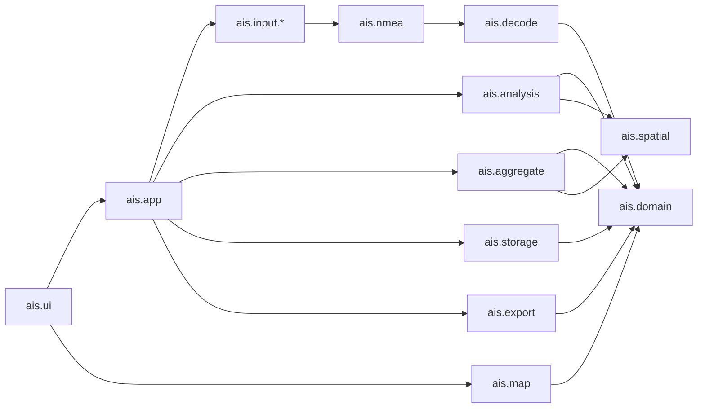
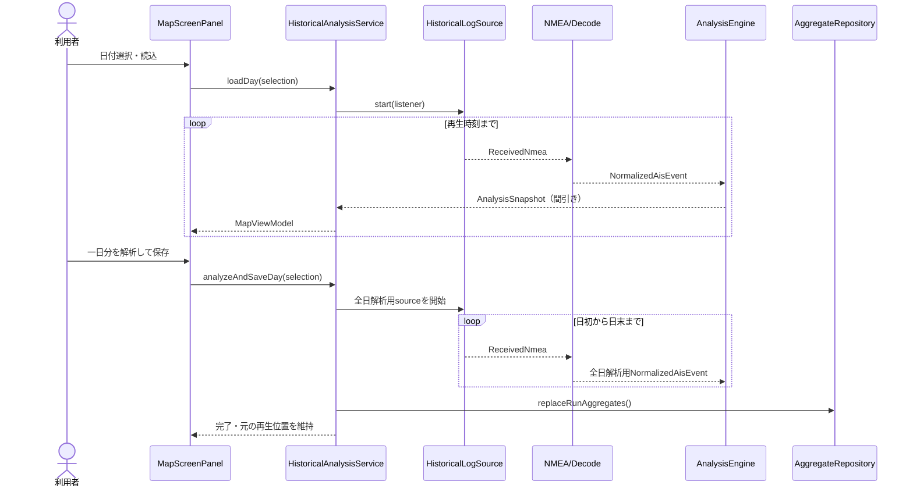
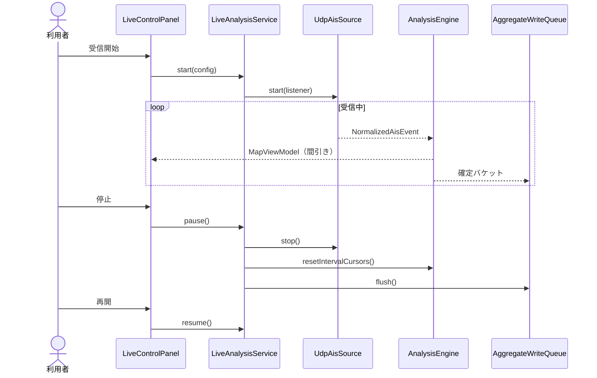

# AISLossAnalyzer 第1段階 プログラム構成設計書

- 文書版: 1.0（確定版）
- 作成日: 2026-09-04
- 状態: 第1段階のプログラム構成設計として確定
- 確定日: 2026-09-04
- 上位文書: `docs/basic_design_ja.md`
- 関連文書: `docs/screen_detail_design_ja.md`

## 1. 目的と範囲

本書は、基本設計書と画面詳細設計書で確定した第1段階を、Javaコードへ分割できる粒度まで具体化する。対象は次の4点である。

1. クラスとパッケージの構成
2. 過去ログ、リアルタイム受信、解析、集計、保存、画面間のデータ受け渡し
3. Swing、解析処理、SQLiteのスレッド境界と状態管理
4. 現行コードの再利用、改修、置換、移行順序

本書では画面の座標や色などは再定義せず、画面詳細設計書に従う。また、仮想船舶、交通量増減、電波伝搬、SOTDMA衝突モデルは第2段階とし、第1段階の実装クラスには含めない。ただし、将来入力を追加しても解析処理を複製しない境界は先に用意する。

## 2. 採用する構成

### 2.1 構成方式

第1段階は、単一のJavaアプリケーション内を責務別パッケージに分ける**モジュラーモノリス**とする。

- 実行プロセスは1つとし、研究室のWindows PC一台で動作させる。
- GUI、過去ログ再生、UDP受信、解析、SQLite保存を別サービスへ分散しない。
- パッケージ間には依存方向を設け、巨大な画面クラスや集計クラスへの再集中を防ぐ。
- AIS-Controllerのコードや実行プロセスには依存しない。研究室LANから届くUDPデータだけを外部入力として扱う。
- 過去ログとリアルタイムは入力部だけを分け、デコード後は同じ解析エンジンを通す。

### 2.2 依存方向



依存に関する規則は次のとおりとする。

- `ais.domain`はSwing、UDP、ファイル、SQLiteへ依存しない。
- `ais.analysis`と`ais.aggregate`は画面部品を参照しない。
- `ais.ui`は`FileLoader`、`DatagramSocket`、JDBCを直接操作しない。
- `ais.storage`はSwingを参照せず、画面用の文字列や色を返さない。
- `ais.input.history`と`ais.input.live`は互いを参照しない。
- 外部ライブラリへの依存は、投影、SQLite、グラフの各実装クラス内に閉じ込める。

## 3. ソース構成

標準のビルド構成へ段階的に移行する。

```text
AISLossAnalyzer/
  pom.xml
  mvnw
  mvnw.cmd
  .mvn/wrapper/
  src/main/java/ais/
    app/
    config/
    input/
      history/
      live/
    nmea/
    decode/
    domain/
    analysis/
    spatial/
    aggregate/
    storage/
    map/
    ui/
    export/
  src/main/resources/
    db/migration/
    app-defaults.properties
  src/test/java/ais/
  src/test/resources/
  docs/
  senc/
```

現行の`src/ais`と`test/ais`は、最初から一括移動しない。ビルド設定で一時的に認識させ、新構成のテストが揃った単位から移す。`senc`は実行時データであり、JAR内リソースには埋め込まない。

## 4. 共通データモデル

### 4.1 時刻の扱い

内部時刻は`Instant`で保持し、表示および日・曜日・月・年の区切りだけを`Asia/Tokyo`へ変換する。

- 過去ログの17桁日本時刻は、`LocalDateTime`として解析後、`Asia/Tokyo`を付けて`Instant`へ変換する。
- リアルタイムはPCへの到着時に`Clock.instant()`で受信時刻を付ける。
- 同一時刻の順番を保つため、入力源ごとに単調増加する`sequence`を持たせる。
- ログにタイムゾーンが書かれていなくても、日本時間であるという研究室データの前提をコード上の設定へ明記する。

### 4.2 `ais.domain`の主要型

| クラス／列挙型 | 役割 | 主な値 |
| --- | --- | --- |
| `SourceMode` | 入力モード | `HISTORICAL`, `LIVE` |
| `VesselClass` | 船舶クラス | `CLASS_A`, `CLASS_B`, `UNKNOWN` |
| `GeoPosition` | 緯度経度の不変値 | latitude、longitude。生成時に範囲検証 |
| `ReceiverProfile` | 受信局条件 | ID、名称、位置、海面上アンテナ高、機器型番、有効期間、注記 |
| `AnalysisProfile` | 解析条件一式 | 条件版、格子幅、鮮度倍率、距離帯、除外閾値、色区分版 |
| `PositionReport` | Type 1/2/3/18の正規化位置報告 | 時刻、MMSI、Type、Class、位置、SOG、COG、真方位、航行状態、Class B方式 |
| `VesselMetadataUpdate` | Type 5/24の正規化静的情報 | 時刻、MMSI、船名、船種、寸法、呼出符号など取得できた項目 |
| `NormalizedAisEvent` | デコード後イベントの共通型 | `PositionReport`または`VesselMetadataUpdate` |
| `VesselMetadata` | 画面表示用の有効な静的情報 | MMSIをキーに時点有効な値を統合 |
| `VesselDisplayState` | 地図へ渡す船舶状態 | 位置、向き、Class、鮮度、選択航跡、表示可否 |
| `AnalysisRunId` | 一回の解析または受信セッションID | UUID相当の不変値 |

`AisMessage`のような全Type共用の可変フィールド集合は、新しい処理境界では使用しない。Typeごとの差は、`PositionReport`と`VesselMetadataUpdate`へ正規化する。移行中だけ現行`AisMessage`から新型へのアダプターを置く。

## 5. 入力からデコードまで

### 5.1 共通入力インターフェース

`ais.input`に次の境界を置く。

```java
public interface MessageSource extends AutoCloseable {
    SourceMode mode();
    SourceStatus status();
    void start(SourceListener listener);
    void stop();
}

public interface SourceListener {
    void onRecord(ReceivedNmea record);
    void onDiagnostic(InputDiagnostic diagnostic);
    void onCompleted();
    void onFailure(Throwable error);
}

public record ReceivedNmea(
        Instant receivedAt,
        long sequence,
        String sentence,
        SourceReference source) {}
```

`MessageSource`は受信したNMEA行を通知するだけとし、欠落計算や画面更新は行わない。`SourceReference`には、過去ログならファイル名と行番号、リアルタイムなら接続設定名を保持する。生のNMEA本文は解析中だけ扱い、SQLiteには保存しない。

### 5.2 `ais.input.history`

| クラス | 責務 |
| --- | --- |
| `HistoricalFileCatalog` | 設定されたデータルートを走査し、日付と対象ファイルの対応を作る |
| `HistoricalDaySelection` | 選択日、同日ファイル一覧、直接選択ファイルを表す不変値 |
| `HistoricalLogSource` | `.ais`/`.ais.gz`を順次読み、`ReceivedNmea`へ変換する |
| `HistoricalLineParser` | 17桁日本時刻とNMEA本文を分離する |
| `ReplayTimeline` | 同日複数ファイルを時刻・sequence順へ統合する |
| `ReplayClock` | 再生速度、現在再生時刻、停止、シークを管理する |
| `InputFingerprintCalculator` | 対象ファイル集合のSHA-256とサイズを計算する |

同一日の複数ファイルは、`ReplayTimeline`がファイルごとの先頭候補を優先キューで統合する。全行をメモリに展開せず、必要な範囲だけを先読みする。完全同一の圧縮前後ファイルは、カタログ作成時に片方だけを採用する。

### 5.3 `ais.input.live`

| クラス | 責務 |
| --- | --- |
| `UdpSourceConfig` | bindアドレス、ポート、文字コード、受信バッファ等 |
| `UdpAisSource` | UDP受信と行分割、PC到着時刻付与 |
| `LiveSourceStatus` | 未開始、受信中、停止中、異常の状態 |
| `ReceiveClock` | テストで差し替え可能な受信時刻供給。実装は`Clock`を使う |

初期ポート値は17020の候補を設定値として持たせ、コードへ固定しない。停止時はソケットと受信スレッドを終了し、再開時は同一セッションIDのまま新しいソケットを開く。

### 5.4 `ais.nmea`と`ais.decode`

受信行は次の順序で処理する。

```text
ReceivedNmea
  -> NmeaEnvelopeParser
  -> NmeaChecksumValidator
  -> AisFragmentAssembler
  -> CompletedAisPayload
  -> AisPayloadDecoder
  -> DecodedAisEnvelope
  -> InputDeduplicator
  -> NormalizedAisEvent
```

| パッケージ | クラス | 責務 |
| --- | --- | --- |
| `ais.nmea` | `NmeaEnvelopeParser` | `!AIVDM`/`!AIVDO`の項目分解 |
| `ais.nmea` | `NmeaChecksumValidator` | NMEAチェックサム検証 |
| `ais.nmea` | `AisFragmentAssembler` | 複数フラグメントの再構成 |
| `ais.nmea` | `FragmentBuffer` | sequence/channel/sourceをキーにした一時保持とタイムアウト |
| `ais.decode` | `AisPayloadDecoder` | Type番号を判別しType別デコーダーへ委譲 |
| `ais.decode` | `DecodedAisEnvelope` | 正規化イベントに、重複判定用のMMSI、Type、完成payload識別値を添える |
| `ais.decode` | `InputDeduplicator` | デコード後にMMSI、Type、完成payloadが同じものを1秒以内で除外 |
| `ais.decode` | `SixBitPayload` | ビット抽出、符号付き数値、AIS文字列変換 |
| `ais.decode` | `Type123Decoder` | Class A位置報告 |
| `ais.decode` | `Type18Decoder` | Class B位置報告とCS/SO判定 |
| `ais.decode` | `Type5Decoder` | Class A静的・航海情報 |
| `ais.decode` | `Type24Decoder` | Class B静的情報Part A/Bの統合素材 |
| `ais.decode` | `LegacyMessageAdapter` | 移行中の現行`AisMessage`との変換 |

不正チェックサム、デコード不能、分割未完成、重複、非対象Typeは`InputDiagnostic`として件数化する。これらを推定欠落数へ直接加算しない。

## 6. 解析エンジン

### 6.1 公開境界

```java
public interface AnalysisEngine {
    void begin(AnalysisContext context);
    List<AnalysisEvent> accept(NormalizedAisEvent event);
    void resetIntervalCursors(Instant resumedAt);
    AnalysisSnapshot snapshot(Instant displayTime, AnalysisFilter filter);
    AnalysisRunSummary complete(Instant endedAt);
}
```

`AnalysisContext`は受信局プロファイル、解析条件、入力モード、セッションID、開始日時を保持する。解析エンジンは一つの解析キュースレッドからのみ呼び、内部状態にロックを持たせない。

### 6.2 `ais.analysis`のクラス

| クラス | 責務 |
| --- | --- |
| `DefaultAnalysisEngine` | 正規化イベントを船舶状態、区間評価、集計へ順に渡す統括 |
| `VesselStateStore` | MMSI別の現在位置、Class、直近報告、航跡、静的情報を保持 |
| `VesselAnalysisState` | 1船の解析状態 |
| `IntervalCursorStore` | MMSIと解析種別別の直前有効位置報告を保持 |
| `ReportRatePolicy` | 位置報告から期待送信間隔を求めるインターフェース |
| `SpecificationReportRatePolicy` | 現行`ReportRateTable`の確定規則を実装 |
| `CourseChangeTracker` | 30秒円平均、5度判定、20秒解除を管理 |
| `IntervalEvaluator` | 30分以上の空白、30km超の距離差等を判定 |
| `LossEstimator` | `max(0, round(actual/expected)-1)`を計算 |
| `FreshnessEvaluator` | 期待間隔×2/3/5と経過時間から鮮度状態・違反時間を計算 |
| `MissingPositionEstimator` | 推定送信時刻と前後位置の線形補間を生成 |
| `TrailBuffer` | 画面用にMMSI別の直近10/30/60分航跡を保持 |
| `AnalysisSnapshotFactory` | 可変状態からUI用の不変スナップショットを作る |

`IntervalEvaluator`の戻り値は真偽値ではなく、採用区間または除外理由を持つ型とする。

```java
public sealed interface IntervalEvaluation {
    record Accepted(AnalyzedInterval interval) implements IntervalEvaluation {}
    record Excluded(IntervalExclusionReason reason) implements IntervalEvaluation {}
}
```

除外理由は少なくとも`FIRST_REPORT`、`GAP_30_MINUTES_OR_MORE`、`DISTANCE_JUMP_OVER_30_KM`、`INVALID_POSITION`、`LIVE_PAUSE_BOUNDARY`を区別する。

### 6.3 1件の位置報告を処理する順序

1. `VesselStateStore`がMMSIの表示状態を更新する。
2. `CourseChangeTracker`が現在の方向変化状態を更新する。
3. `ReportRatePolicy`が区間始点側の期待送信間隔を決定する。
4. `IntervalCursorStore`から同じMMSI・解析種別の直前報告を得る。
5. `IntervalEvaluator`が区間の採用可否を判定する。
6. 採用時は`LossEstimator`で欠落数を求める。
7. `MissingPositionEstimator`が欠落位置を補間する。
8. `FreshnessEvaluator`が区間中の正常時間と鮮度違反時間を求める。
9. `SessionAggregator`へ区間を渡す。
10. 現在報告を次回の区間始点としてカーソルへ保存する。

期待送信間隔は必ず**区間始点メッセージの状態**から求める。これをクラス契約とテスト名で固定し、過去ログとリアルタイムで判定差が出ないようにする。

### 6.4 一時停止、リセット、シーク

- リアルタイム停止時は船舶表示を保持するが、`IntervalCursorStore`と`CourseChangeTracker`の連続区間状態を破棄する。再開後の最初の報告は新しい始点になり、停止時間を欠落へ変換しない。
- リアルタイムのリセットは現在の解析実行を確定して新しい`AnalysisRunId`を発行し、船舶、航跡、カーソル、集計を空にする。
- 過去ログの後方シークは、現在の可変集計から減算しない。日初から移動先時刻までをバックグラウンドで新しいエンジンへ再投入し、完了後に画面スナップショットを一括交換する。
- 過去ログの前方シークは、未処理区間を高速投入する。ただし実装の単純性を優先し、最初の版では前後とも再計算方式でもよい。

## 7. 空間処理と集計

### 7.1 `ais.spatial`

| クラス | 責務 |
| --- | --- |
| `DistanceCalculator` | 緯度経度間の距離計算インターフェース |
| `HaversineDistanceCalculator` | 現行計算式の実装 |
| `CoordinateProjector` | 緯度経度から平面座標への変換境界 |
| `Utm53NProjector` | EPSG:32653相当の投影実装 |
| `ProjectedPoint` | Easting、Northing |
| `GridDefinition` | 原点、格子幅2km、座標から格子IDへの変換 |
| `GridCellId` | zone、行、列で一意になる格子識別子 |
| `TrackInterpolator` | 時刻比に基づく位置補間 |
| `GridSegmentAllocator` | 区間時間を通過格子へ配分 |
| `DistanceBandDefinition` | 0～70kmを5km幅へ分類し、70km超を診断扱いにする |

地図描画用のメルカトル系投影と解析用UTM 53Nを混同しない。前者は`ais.map`、後者は`ais.spatial`に置く。

### 7.2 `ais.aggregate`

| クラス | 責務 |
| --- | --- |
| `SessionAggregator` | 解析済み区間を各集計器へ配布する |
| `GridMetricAccumulator` | 5分×2km格子×Classのobserved/missing/時間を加算 |
| `DistanceMetricAccumulator` | 5分×5km距離帯×Classを加算 |
| `VesselPresenceAccumulator` | 集計単位ごとの異なるMMSI集合を保持 |
| `AggregateKey` | 時間バケット、空間キー、Class、解析実行を表す |
| `MetricCounts` | observed、missing、observedSeconds、staleSecondsの不変値 |
| `MetricCalculator` | 欠落率、鮮度違反率、データ不足判定を計算 |
| `AggregationSnapshot` | 地図、表、グラフへ渡す読取専用集計 |
| `PeriodRollupService` | 日、曜日、月、年、時刻帯、距離帯への再集計 |

データ不足は`expected < 30 OR distinctVessels < 3`で判定する。率だけを保存せず、分子と分母を保存して長期間集計時に再計算する。

## 8. 保存構成

### 8.1 リポジトリ境界

`ais.storage`にJDBC実装を閉じ込め、アプリケーション層は次のインターフェースだけを使用する。

```java
public interface AnalysisRunRepository {
    AnalysisRunId begin(AnalysisRun run);
    void complete(AnalysisRunSummary summary);
    Optional<StoredAnalysisRun> findEquivalent(InputFingerprint input,
                                               ReceiverProfileId receiver,
                                               AnalysisProfileId profile);
    Optional<StoredAnalysisRun> findById(AnalysisRunId runId);
}

public interface AggregateRepository {
    void replaceRunAggregates(AnalysisRunId runId, AggregateBatch batch);
    AggregationSnapshot query(AggregateQuery query);
}

public interface ReceiverProfileRepository { /* CRUDと日時有効検索 */ }
public interface AnalysisProfileRepository { /* 版管理と読取 */ }
public interface VesselMetadataRepository { /* MMSI別履歴と日時有効検索 */ }
public interface DiagnosticRepository {
    void saveSummary(AnalysisRunId runId, List<DiagnosticSummary> summary);
    void saveExclusionPeriods(AnalysisRunId runId,
                              List<AnalysisExclusionPeriod> periods);
}
```

### 8.2 実装クラス

| クラス | 責務 |
| --- | --- |
| `SqliteDatabase` | 接続URL、PRAGMA、接続生成 |
| `SchemaMigrator` | `schema_version`を使う順次DDL適用 |
| `TransactionRunner` | commit/rollbackの共通化 |
| `JdbcAnalysisRunRepository` | 解析実行と同一入力置換 |
| `JdbcAggregateRepository` | 格子・距離帯・船舶出現の一括保存と検索 |
| `JdbcReceiverProfileRepository` | 受信設備履歴 |
| `JdbcAnalysisProfileRepository` | 解析条件版 |
| `JdbcVesselMetadataRepository` | Type 5/24のMMSI別履歴 |
| `JdbcDiagnosticRepository` | 診断コード別要約とPC処理遅延の除外時間帯 |
| `AnalysisResultStore` | 新規実行・集計・診断・旧実行切替を一つのトランザクションで確定 |
| `AggregateWriteQueue` | 解析スレッドから受けたバッチを単一DBスレッドで書く |

過去ログの置換は、一時的な新規実行へ集計を保存し、成功後にトランザクション内で旧実行との有効状態を切り替える。解析失敗時は既存の正常結果を残す。リアルタイムは生ログを保存せず、5分バケット確定時と停止・リセット・終了時に集計を書き出す。

## 9. アプリケーション層

`ais.app`は画面操作を一つのユースケースとしてまとめ、入力・解析・保存の順序を制御する。

| クラス | 責務 |
| --- | --- |
| `AisLossAnalyzerApplication` | `main`、Swing EDT起動 |
| `ApplicationContext` | 設定、リポジトリ、エンジン、各サービスの生成と配線 |
| `ApplicationController` | 画面切替、終了可否、全体状態 |
| `HistoricalAnalysisService` | 日付選択、読込、再生、シーク、全日解析保存の開始と状態管理 |
| `FullDayAnalysisJob` | 再生用エンジンとは別に一日分を日初から日末まで解析し、成功結果を保存するキャンセル可能処理 |
| `LiveAnalysisService` | UDP開始、停止、再開、リセット、終了確定 |
| `AggregateQueryService` | SQLite集計検索と画面用データ変換 |
| `ReceiverProfileService` | 受信局設定の検証と有効期間管理 |
| `ExportService` | 現在の表示条件を固定してCSV/PNG出力へ委譲 |
| `OperationGuard` | 受信中の画面切替禁止、二重開始防止等 |

サービスの公開メソッドは、成功時の値だけでなく進捗、キャンセル、利用者向けエラーを扱える`OperationHandle<T>`を返す。UIはワーカースレッドを直接生成しない。

### 9.1 アプリケーション状態

```text
ApplicationState
  activeScreen
  sourceMode
  operationState       IDLE / LOADING / REPLAYING / RECEIVING / PAUSED / FAILED
  selectedDay
  replayTime
  liveSessionId
  analysisProfile
  receiverProfile
  mapSelection         ship and/or cell
  displayFilters
```

状態変更は`ApplicationController`を経由させる。Swing部品の選択状態を業務状態の正本にしない。

## 10. 画面クラス構成

### 10.1 `ais.ui`

| クラス | 対応画面・責務 |
| --- | --- |
| `MainFrame` | 唯一の`JFrame`。上部ナビゲーション、中央カード、下部ステータス |
| `TopNavigationPanel` | 地図、集計、受信局、設定の画面切替 |
| `StatusBar` | 処理状態、進捗、診断件数、簡潔なエラー |
| `MapScreenPanel` | 左地図＋右操作領域の親 |
| `MapCanvas` | 海岸線、陸地、河川、受信局、距離円、格子、船舶、航跡、凡例の描画 |
| `MapToolbar` | 拡大縮小、範囲リセット等 |
| `SourceModePanel` | 過去ログとリアルタイムのモード切替 |
| `HistoricalControlPanel` | 日付、ファイル、速度、再生、時刻スライダー |
| `LiveControlPanel` | 接続情報、開始、停止、再開、リセット |
| `DisplayOptionsPanel` | 指標、Class、鮮度倍率、航跡時間等 |
| `SelectionDetailPanel` | 船舶詳細と格子詳細を同時表示できる親 |
| `VesselDetailPanel` | 選択船の情報。絶対の最終受信日時は表示しない |
| `GridCellDetailPanel` | 選択格子の率、分子分母、船舶数、データ不足 |
| `MapLegendPanel` | 9色、データ不足、Class枠線、情報鮮度。折りたたみ可能 |
| `AggregateScreenPanel` | 条件、表、距離帯・時間帯グラフ |
| `ReceiverProfileScreenPanel` | 受信局履歴の編集 |
| `SettingsScreenPanel` | データルート、SENC、SQLite、UDP初期値 |
| `ErrorDialog` | 継続不能または詳細確認が必要なエラー |

右側領域は標準画面サイズではスクロールなしで収める。小さいウィンドウ、Windows表示倍率、大きい文字、船舶・格子詳細の同時表示で収まらない場合だけ`JScrollPane`を有効にする。

### 10.2 ViewModel

UIは解析中のMapやListを直接参照せず、`ais.ui.viewmodel`の不変モデルを受け取る。

| クラス | 内容 |
| --- | --- |
| `MapViewModel` | 表示時刻、船舶一覧、選択航跡、格子値、受信局、凡例、進捗 |
| `VesselDetailViewModel` | 表示項目と未取得表記、最終受信からの経過時間 |
| `GridDetailViewModel` | 指標値、observed、missing、expected、時間、船舶数 |
| `AggregateViewModel` | 条件、表行、グラフ系列、データ不足理由 |
| `StatusViewModel` | 状態文、進捗率、警告・診断件数 |

ViewModelは`Color`、`JComponent`、JDBC型を含めない。色の対応はUI側の`HeatmapColorScale`と`VesselSymbolStyle`が決める。

## 11. 地図構成

`ais.map`はSENCデータと地図座標変換を扱い、Swing描画そのものは`MapCanvas`に残す。

| クラス | 責務 |
| --- | --- |
| `SencCatalog` | `senc`配下の対象セル発見 |
| `SencReader` | 必要な海岸線、陸地、河川だけを読む |
| `MapFeature` | 種別と座標列の不変データ |
| `MapDataset` | 読込済み地物の集合 |
| `MapProjection` | 緯度経度と画面論理座標の相互変換 |
| `MercatorMapProjection` | 現行`MeridionalPartsProjector`を基にした実装 |
| `MapViewport` | 中心、縮尺、画面サイズ、パン・ズーム変換 |
| `MapHitTester` | 船舶記号と格子のクリック判定 |
| `MapLayerRenderer` | レイヤー順を固定して描画する |

描画順は地形、格子ヒートマップ、距離円、受信局、航跡、船舶、選択表示、凡例とする。船舶と格子の選択は別フィールドで保持し、空白クリックまたはEscだけが両方を解除する。

## 12. 出力構成

| クラス | 責務 |
| --- | --- |
| `CsvExporter` | 現在の表と解析条件をUTF-8 CSVへ出力 |
| `ChartRenderer` | 距離帯別・時間帯別グラフを画面とPNGへ共通描画 |
| `ChartPngExporter` | 現在のグラフをPNGへ保存 |
| `MapPngExporter` | 凡例を強制展開した地図をオフスクリーン描画 |
| `ExportFileNamer` | 種別、期間、Class、指標を含む安全な初期ファイル名 |
| `ExportMetadataFormatter` | 受信局、解析条件版、期間の注記を生成 |

地図PNGは画面上で凡例を閉じていても、出力用ViewModelだけを凡例展開状態にして描画する。

## 13. スレッドと処理の受け渡し

### 13.1 使用するスレッド

| 実行場所 | 主な処理 |
| --- | --- |
| Swing EDT | 入力イベント受付、画面状態更新、描画 |
| Source worker | ファイル読込またはUDP受信。モードごとに1本 |
| Analysis executor | NMEA検証、デコード、状態更新、解析、セッション集計。必ず1本 |
| Database executor | SQLite一括書込と重い検索。必ず1本 |
| Export worker | CSV、PNGの生成 |

`Source worker`から`Analysis executor`へは上限付き`BlockingQueue<ReceivedNmea>`で渡す。キューが満杯の場合、過去ログは読込を待機する。リアルタイムは無制限にメモリへ貯めず、`SourceOverflow`制御イベントを解析経路へ渡す。解析側は直前の区間カーソルを破棄し、回復後の最初の有効報告を新しい区間始点とする。これにより、PC処理遅延で取り込めなかった時間をAIS通信欠落へ変換しない。超過件数と発生時刻は診断へ記録し、画面警告を利用者が確認するまで残す。キューの具体的な上限値は、実データ性能試験で決める。

解析スナップショットの生成は最大10回/秒までに間引き、EDT側は古い未描画スナップショットを捨てて最新状態を優先する。画面への反映周期は画面詳細設計に従い、過去再生の船舶とヒートマップは最大4回/秒、リアルタイムは最大1回/秒とする。AIS一件ごとに`repaint()`しない。SQLite書込は5分バケットまたは一定件数をまとめ、解析スレッドからJDBCを直接呼ばない。

### 13.2 過去ログ再生シーケンス



全日解析には再生表示用とは別の`AnalysisEngine`を使用し、現在の地図、再生位置、再生途中の集計を変更しない。一日の末尾到達は再生停止だけを行い、自動保存や集計画面への自動遷移はしない。

### 13.3 リアルタイムシーケンス



受信中は別画面への切替を`OperationGuard`が拒否する。アプリ終了時は現在の集計を確定するが、次回起動時に前セッションを再開しない。

## 14. 設定構成

`ais.config`には次を置く。

| クラス | 責務 |
| --- | --- |
| `AppConfig` | データルート、SENC、DB、UDP初期値、UI更新周期 |
| `ApplicationPaths` | `%LOCALAPPDATA%\AISLossAnalyzer`を基準に設定、DB、ログの初期パスを解決する |
| `PropertiesConfigStore` | Java Properties形式の読込・保存 |
| `ConfigValidator` | パス、ポート、範囲、書込可否の検証 |
| `RollingTechnicalLog` | 容量制限付きの技術ログ。生NMEAとpayloadは出力しない |

個人PC固有の絶対パスをソースコードへ書かない。初期状態では`%LOCALAPPDATA%\AISLossAnalyzer`の下に`config\app.properties`、`data\aisloss.db`、`logs\application.log`を配置する。技術ログは初期値5MiB×5世代で循環し、生NMEAとpayloadは書かない。AIS過去ログとSENCは複製せず、設定ファイルに元フォルダーへの参照を保存する。SQLiteとCSV/PNG初期出力先は画面から変更可能にする。受信局履歴と解析条件版はSQLiteで管理する。

## 15. エラーと診断

| 型 | 用途 |
| --- | --- |
| `InputDiagnosticCode` | checksum不正、分割未完成、非対象Type、重複、位置不正等 |
| `InputDiagnostic` | 時刻、コード、source、短い説明。生payloadを永続化しない |
| `DiagnosticCounters` | コード別件数 |
| `DiagnosticSummary` | 解析実行ごとのコード別件数と最初・最後の発生時刻 |
| `AnalysisExclusionPeriod` | PC処理遅延等で解析から切り離した開始・終了時刻と理由 |
| `UserFacingException` | 利用者が修正できる設定・ファイル・接続エラー |
| `TechnicalFailure` | SQLite破損等、詳細ログが必要な障害 |

継続可能な入力異常はステータスバーの件数へ反映し、メッセージごとのダイアログは出さない。処理継続不能な場合だけダイアログを出す。解析実行の確定時には`DiagnosticRepository`へ要約を保存するが、生NMEA、payload、各エラー行は渡さない。

## 16. 現行コードの再利用計画

### 16.1 再利用区分

| 現行クラス | 区分 | 新しい配置／扱い | 具体的な作業 |
| --- | --- | --- | --- |
| `AisAnalysisRules` | ロジック再利用 | `AnalysisProfile`、`IntervalEvaluator` | Typeの束ね方と30分境界を移し、システムプロパティ依存を設定値へ変更 |
| `ReportRateTable` | 中核再利用 | `SpecificationReportRatePolicy` | 現行のClass A/B規則と境界を保持し、`PositionReport`入力へ変更 |
| `ReportRateTracker` | 中核再利用 | `CourseChangeTracker` | 円平均、5度、20秒解除を保持し、時刻を`Instant`へ変更 |
| `LossEstimator` | ほぼそのまま | `ais.analysis.LossEstimator` | 静的な純粋関数として境界テストを追加 |
| `DistanceCalculator` | ほぼそのまま | `HaversineDistanceCalculator` | 受信局固定値を排除し、インターフェース実装へ変更 |
| `AisDecoder` | 部分再利用 | `ais.nmea`、`ais.decode` | `BitPayload`とType別ビット位置を利用。static分割バッファを分離し、checksum、timeout、Type24を追加 |
| `FileLoader` | 部分再利用 | `HistoricalLogSource`、`HistoricalLineParser` | gzip、UTF-8、17桁時刻を利用。全ファイル重複`HashSet`と解析直結を廃止 |
| `DecodedCsvParser` | 互換用再利用 | `DecodedCsvCompatibilityAdapter` | 既存CSV検証用途に残し、本番NMEA経路とは分離 |
| `StreamingVesselStatistics` | 挙動参照 | `DefaultAnalysisEngine`＋`SessionAggregator` | 現行結果との比較元として固定し、直接拡張しない |
| `VesselStatistics` | 互換用 | legacyパッケージ | ストリーミング版と同値確認後に本番呼出しから外す |
| `VesselStatisticsResult` | 互換用 | legacyパッケージ | 既存CSV用だけに残し、新画面では不変`AggregationSnapshot`を使う |
| `DailyStatisticsResult` | 置換 | `AggregationSnapshot` | 公開可変フィールドを廃止 |
| `DistanceBinStatistics` | ロジック参照 | `MetricCounts`、`DistanceMetricAccumulator` | 5km帯、Class、5分バケットへ一般化 |
| `GapAnalyzer` | 廃止候補 | なし | 実処理で使われていないため、参照確認後に移行対象外 |
| `VesselOrganizer` | 廃止候補 | `VesselStateStore` | 全件リスト保持型をリアルタイム状態管理へ置換 |
| `Main` | 移行後に削除 | `AisLossAnalyzerApplication`、解析サービス、`CsvExporter` | 現行`Main`を恒久的な解析クラスにはしない。解析呼出し、集計、CSV出力を各専用クラスへ移し、新旧結果の一致確認が終わるまでだけ旧CLIとして保持する |
| `OsakaBayMap` | 部品再利用 | `ais.map`＋`ais.ui` | SENC読込、投影、パン、ズーム、再生概念を抽出。1049行の単一クラスを基底にしない |
| Pythonスクリプト | 検証用途で維持 | 既存`src/*.py` | 過去研究比較用。GUI実行時依存にはしない |

既存クラスの削除は、新経路の回帰試験が通った後に別作業として行う。利用者が現行コードへ加えた未コミット変更は、移行元として保持する。

### 16.2 `OsakaBayMap`の抽出順

1. 内部`SencReader`を`ais.map.SencReader`へ移し、同じ地図が描けることを確認する。
2. `MeridionalPartsProjector`を`MercatorMapProjection`へ移す。
3. パン、ズーム、座標変換を`MapViewport`へ移す。
4. `AisTimeline`のログ読込を`HistoricalLogSource`と`ReplayClock`へ分ける。
5. 描画を`MapCanvas`へ移し、船舶データを`MapViewModel`から受ける。
6. 右側操作と詳細を個別Panelへ分け、最後に旧`OsakaBayMap`の起動経路を外す。

## 17. ビルドと外部依存の提案

現状は`javac`直接実行で、開発PCにはJDK 26.0.2.1がある一方、MavenとGradleは導入されていない。SQLite、投影、グラフ、JUnitを再現可能に導入するため、次の構成を採用する。

- 開発と実行には、現在のJDK 26.0.2.1を使用する。
- Maven Compiler Pluginの`release`を25に設定し、生成物はJava 25互換とする。
- Maven Wrapperをリポジトリに含め、PCへMavenを別途インストールしなくても`mvnw.cmd`でビルドできるようにする。
- GUI配布は`jpackage`でJavaランタイムを同梱したWindows用アプリケーションイメージを作る。
- 初期配布はMSIではなくフォルダー形式とし、`AISLossAnalyzer.exe`から起動できるようにする。フォルダー全体をZIPで別PCへ移動可能にし、インストール時の管理者権限を要求しない。
- DIフレームワークは使わず、`ApplicationContext`で明示的に組み立てる。
- Java Platform Module Systemの`module-info.java`は初期段階では導入しない。

候補依存は次のとおりである。バージョンは実装開始時に公式情報を確認し、`pom.xml`へ固定する。

| 用途 | 候補 | 理由 |
| --- | --- | --- |
| SQLite | Xerial SQLite JDBC | 単一ファイルDBをJDBCで扱う |
| UTM投影 | Proj4J | EPSG:32653変換を自作せず試験可能にする |
| グラフ | JFreeChart | Swing上の表示とPNG描画を共通化しやすい |
| テスト | JUnit 5 | 単体、パラメータ、結合テスト |

外部依存をダウンロードするのはビルド時だけで、通常利用時のインターネット接続は不要とする。

## 18. テストクラス構成

| テスト群 | 主な対象 |
| --- | --- |
| `ais.decode.*Test` | Type 1/2/3/5/18/24、利用不能値、分割、checksum |
| `ais.analysis.ReportRatePolicyTest` | 確定した全速度境界、航行状態、CS/SO、変針 |
| `ais.analysis.CourseChangeTrackerTest` | 円平均、0/360度境界、5度、20秒 |
| `ais.analysis.IntervalEvaluatorTest` | 30分、30km、停止境界、区間始点規則 |
| `ais.analysis.LossEstimatorTest` | round境界と欠落0 |
| `ais.spatial.*Test` | UTM既知点、2km境界、補間、格子通過時間、70km |
| `ais.aggregate.*Test` | 5分、Class、日付、曜日、月、暦年、異なる船舶数、データ不足 |
| `ais.storage.*Test` | migration、rollback、同一入力置換、条件別保持、履歴時点検索 |
| `ais.app.SourceParityTest` | 同一列を過去と模擬リアルタイムへ与えた結果の一致 |
| `ais.ui.*Test` | ViewModel変換、操作可否、選択状態。描画は画像の目視確認も併用 |

現行のmainメソッド型テストは、最初にJUnitから呼び出せる回帰試験として包み、新旧結果が一致してから新実装だけのテストへ切り替える。現行`Main`も同じ移行期間だけ比較用に保持し、一致確認後に削除する。

## 19. 実装順序

### 反復1: 開発基盤と解析コアの固定

1. Maven Wrapper、JUnit 5、標準ディレクトリを追加する。
2. `domain`の不変型と`LegacyMessageAdapter`を追加する。
3. `ReportRateTable`、`ReportRateTracker`、`LossEstimator`を新境界へ移す。
4. 現行データで旧集計との一致テストを作る。

### 反復2: 共通入力パイプライン

1. NMEA検証、分割再構成、重複除外、Type別デコードを分離する。
2. `HistoricalLogSource`を追加し、1日・複数ファイルを処理する。
3. `UdpAisSource`を追加し、同じ解析エンジンへ接続する。
4. 過去入力と模擬リアルタイム入力の一致試験を行う。

### 反復3: 欠落・鮮度・空間集計

1. `DefaultAnalysisEngine`、区間評価、停止境界を実装する。
2. UTM 53N、2km格子、5km距離帯、補間を実装する。
3. 5分×格子×Classの欠落・鮮度集計を実装する。
4. 日、曜日、月、年、距離帯、時間帯の再集計を実装する。

### 反復4: SQLite

1. schema migrationと各Repositoryを追加する。
2. 同一入力置換、条件別保存、失敗時rollbackを確認する。
3. Type 5/24のMMSI別履歴を実装する。

### 反復5: 地図・再生画面

1. `OsakaBayMap`からSENC、投影、viewportを抽出する。
2. `MainFrame`、`MapScreenPanel`、右側操作、ViewModelを実装する。
3. 1日再生、60倍、スライダー、後方再計算を接続する。
4. 明示操作による一日分の全日解析とSQLite保存を接続する。
5. 格子色、船舶記号、航跡、選択詳細、凡例を接続する。

### 反復6: リアルタイム・集計・出力

1. 開始、停止、再開、リセット、画面切替制限を接続する。
2. 集計画面と距離帯・時間帯グラフを接続する。
3. CSV、グラフPNG、凡例付き地図PNGを実装する。
4. Windows PC上で長時間、容量、終了時保存を確認する。

各反復は「設計差分→実装→自動テスト→画面または実データ確認→利用者確認」で完了させる。

## 20. 完了判定

プログラム構成として、次を満たした時点で第1段階の構成を完成とする。

- 過去ログとリアルタイムで、`NormalizedAisEvent`以降のコード経路が共通である。
- 期待間隔、欠落、鮮度、補間、格子、距離帯がSwingやJDBCに依存しない。
- 画面は不変ViewModelだけを読み、解析中の可変Mapを直接参照しない。
- 一時停止時間と30分以上の区間が欠落へ混入しない。
- SQLiteの同一入力置換がトランザクションで行われる。
- `OsakaBayMap`の必要機能が小さい責務へ抽出される。
- 既存計算との一致を確認する回帰テストがある。
- 第2段階で新しい`MessageSource`を追加しても、解析・集計・UI表示契約を作り直さずに済む。

## 21. 設計レビュー事項

本書の中で、次の事項を実装開始前に確認する。

| 項目 | 状態 | 方針 |
| --- | --- | --- |
| Javaとビルド基盤 | 確定 | JDK 26.0.2.1で開発・実行し、Maven Wrapperを採用してJava 25互換でビルドする |
| 投影・グラフライブラリ | 確定 | UTM投影にProj4J、グラフにJFreeChartを使用する |
| 現行`Main`の扱い | 確定 | 恒久的な解析クラスにはせず、再利用可能な処理を専用クラスへ移す。新旧結果の一致確認まで旧CLIとして保持し、その後削除する |
| 現行`OsakaBayMap`の扱い | 確定 | 動作比較用に残しながらSENC読込、投影、パン、ズーム、再生機能を新しい小クラスへ順次抽出し、新画面完成後に削除する |
| AISメッセージモデル | 確定 | Type 1/2/3/18は`PositionReport`、Type 5/24は`VesselMetadataUpdate`へ分け、`NormalizedAisEvent`として共通経路へ渡す。現行`AisMessage`は移行用アダプターに限定する |
| スレッド構成 | 確定 | Swing EDT、入力、単一の順序付き解析、単一のDB処理、出力処理へ分離し、UIへ渡すスナップショットを間引く |
| 内部時刻 | 確定 | 過去ログ時刻を日本時間として解釈し、リアルタイム到着時刻とともに内部では`Instant`へ統一する。表示と期間集計時に`Asia/Tokyo`へ変換する |
| 過去ログのメモリ管理 | 確定 | 一日分をストリーミング処理し、現在状態・最大60分航跡・集計値だけを保持する。後方シークは日初からバックグラウンド再計算し、必要になるまで索引を追加しない |
| 過去ログの全日保存 | 確定 | `一日分を解析して保存`を明示操作として追加し、再生位置とは別のエンジンで全日解析する。ログ終端では自動保存しない |
| リアルタイム過負荷 | 確定 | 上限付き入力キューの超過を`SourceOverflow`として扱い、前後の区間カーソルを切る。AIS欠落へ加算せず、PC処理遅延として警告・診断する |
| 診断情報の保存 | 確定 | 解析実行ごとのコード別件数と最初・最後の発生時刻、PC処理遅延の除外時間帯だけをSQLiteへ保存し、生NMEA・payload・各エラー行は保存しない |
| Windows上の保存場所 | 確定 | `%LOCALAPPDATA%\AISLossAnalyzer`の下に設定、SQLite、容量制限付き技術ログを置く。AISログとSENCは複製せず元フォルダーを参照し、DB場所は変更可能にする |
| 配布・起動方式 | 確定 | `jpackage`のフォルダー形式でJavaランタイムと`AISLossAnalyzer.exe`を同梱する。利用PCへのJava・Maven導入や管理者権限を不要にする |

### 21.1 決定履歴

| 日付 | 決定内容 |
| --- | --- |
| 2026-09-04 | JDK 26.0.2.1で開発・実行し、Maven Wrapperを採用してJava 25互換でビルドする方針を確定 |
| 2026-09-04 | UTM 53Nへの投影にProj4J、画面表示とPNG出力のグラフ描画にJFreeChartを採用する方針を確定 |
| 2026-09-04 | 現行`Main`は解析機能を専用クラスへ移した後、新旧結果の一致確認を経て削除する方針を確定 |
| 2026-09-04 | 現行`OsakaBayMap`は比較用に残しながら機能を新画面構成へ抽出し、新画面完成後に削除する方針を確定 |
| 2026-09-04 | 位置報告と船舶情報更新を別の不変データ型へ分け、現行`AisMessage`は移行時だけ変換して使用する方針を確定 |
| 2026-09-04 | Swing EDT、入力、単一解析、単一DB、出力の各処理を分離し、画面更新を間引くスレッド構成を確定 |
| 2026-09-04 | 過去ログの日本時刻とリアルタイム到着時刻を内部では`Instant`へ統一し、表示・集計時に日本時間へ変換する方針を確定 |
| 2026-09-04 | 過去ログは全件を保持せずストリーミング処理し、後方シークは日初から再計算する方針を確定 |
| 2026-09-04 | 過去ログ画面へ`一日分を解析して保存`を追加し、再生位置と独立した全日解析としてSQLiteへ保存する方針を確定 |
| 2026-09-04 | リアルタイム入力キュー超過の影響区間をAIS欠落率から除外し、PC処理遅延として警告・診断する方針を確定 |
| 2026-09-04 | 診断情報はコード別要約とPC処理遅延の除外時間帯だけをSQLiteへ保存し、生データは保存しない方針を確定 |
| 2026-09-04 | Windowsの`%LOCALAPPDATA%\AISLossAnalyzer`へ設定・SQLite・技術ログを置き、AISログとSENCは元フォルダーを参照する方針を確定 |
| 2026-09-04 | `jpackage`のフォルダー形式でJavaランタイムを同梱し、`AISLossAnalyzer.exe`から起動する配布方式を確定 |
| 2026-09-04 | 本書を第1段階のプログラム構成設計書として確定 |
