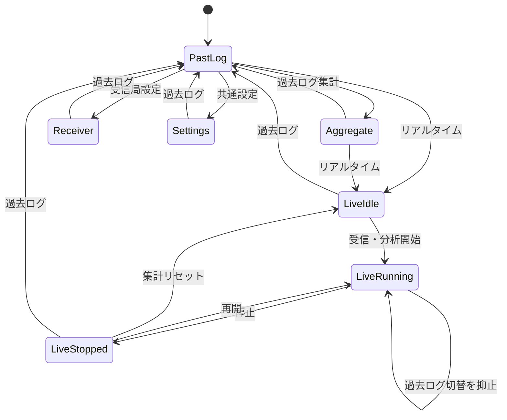

# AISLossAnalyzer 第1段階 画面詳細設計書

- 文書版: 2.6（確定版）
- 作成日: 2026-09-04
- 更新日: 2026-09-08
- 上位文書: `docs/basic_design_ja.md`
- 対象: Java + Swing版AISLossAnalyzer
- 状態: 第1段階の画面詳細設計として確定
- 確定日: 2026-09-04

## 1. 目的

本書は、基本設計で確定した第1段階の機能を、Swing画面として実装できる粒度まで具体化する。画面一覧、画面遷移、部品配置、表示項目、操作、状態、入力検証、更新契機、エラー表示、受入確認項目を定義する。

計算式、集計単位、保存テーブルの詳細な根拠は上位の基本設計書に従う。本書では計算結果をいつ、どこに、どの状態で表示・操作するかを扱う。

本書の確定後、画面の役割、操作手順、表示データの意味、解析セッションの境界を変更する場合は文書版を更新して変更理由を記録する。実機解像度に合わせた寸法、余白、船舶記号サイズ、ヒートマップ透明度など、意味を変えない調整は実装・試験時の調整事項として扱う。

## 2. 画面設計方針

1. 過去ログとリアルタイムを一つのメインウィンドウで扱う。
2. 地図を常に主表示とし、操作と詳細情報を右側へまとめる。
3. 同じ指標、Classフィルター、地図レイヤーを両モードで共通利用する。
4. 実行状態を明示し、解析中の条件変更や誤ったモード切替を防ぐ。
5. 色だけに依存せず、凡例、文字、枠線、状態名を併用する。
6. 長時間処理をSwing Event Dispatch Threadで実行しない。
7. 研究用出力には、期間、指標、Class、受信局、解析条件、凡例を残す。

### 2.1 承認済みの全体配置

2026-09-04に、次の全体配置を画面設計の基準として確定した。

- 上部で過去ログ、リアルタイム、集計、受信局設定、共通設定を切り替える。
- 左側を主地図領域とする。
- 右側にモード別操作、表示条件、選択対象の詳細情報を置く。
- 地図左下に指標、データ不足、Class、船舶鮮度の凡例を置く。
- 下部に処理状態、時刻、件数、診断、警告を置く。

## 3. 画面一覧

| 画面ID | 画面名 | 目的 | 表示方式 |
| --- | --- | --- | --- |
| SC-01 | 過去ログ | 一日分ログの再生、地図表示、時点までの解析 | メインウィンドウの中央画面 |
| SC-02 | リアルタイム | UDP受信の開始・停止、現在状態と解析結果の表示 | SC-01と地図を共有するモード |
| SC-03 | 集計 | 保存済み結果の期間・距離・時間帯比較 | メインウィンドウ内の画面切替 |
| SC-04 | 受信局設定 | 受信局プロファイルの登録・編集・適用期間確認 | メインウィンドウ内の画面切替 |
| SC-05 | 共通設定 | 入力、解析、表示、出力の設定 | メインウィンドウ内の画面切替 |
| DL-01 | ログ選択 | 親フォルダー外の過去ログを直接選択 | OS標準ファイル選択ダイアログ |
| DL-02 | 集計リセット確認 | リアルタイムの現在集計を終了して新規開始 | 確認ダイアログ |
| DL-03 | 出力先選択 | CSVまたはPNGの保存先を選択 | OS標準保存ダイアログ |
| DL-04 | 入力・保存エラー | 修正または再試行が必要な問題を表示 | モーダルダイアログ |

SC-01とSC-02を本書では「地図画面」と総称する。

## 4. 画面遷移



リアルタイム受信中は過去ログ、集計、受信局設定、共通設定への切替を無効化する。停止後に切替可能とする。

## 5. 共通ウィンドウ

### 5.1 ウィンドウ仕様

| 項目 | 仕様 |
| --- | --- |
| タイトル | `AISLossAnalyzer` |
| 初期サイズ | 1440 × 900pxを基準に、画面内へ収まる大きさで表示 |
| 最小サイズ | 1200 × 720px |
| サイズ変更 | 可 |
| 終了操作 | 実行中処理がなければ終了。リアルタイム受信中は停止・保存して終了するか確認 |
| 初期画面 | SC-01 過去ログ |
| 文字 | Windows標準の日本語UIフォントを使用 |

右側パネルは基準幅340pxとし、ウィンドウ拡大分は主に地図へ配分する。基準サイズでは、必要な項目が右側パネル内へスクロールなしで収まるよう、項目名と値の二列配置、短い余白、選択時だけ現れる詳細欄を使用する。

右側の縦スクロールは常時表示しない。利用者がウィンドウを小さくした場合、Windowsの表示倍率または文字サイズを大きくした場合、船舶と格子の両詳細が収まらない場合だけ使用するフォールバックとする。地図領域全体をスクロール領域にはしない。

### 5.2 上部ナビゲーション

| 部品ID | 種類 | 表示 | 動作 |
| --- | --- | --- | --- |
| NAV-01 | タブ | 過去ログ | SC-01へ切替 |
| NAV-02 | タブ | リアルタイム | SC-02へ切替 |
| NAV-03 | タブ | 集計 | SC-03へ切替 |
| NAV-04 | タブ | 受信局設定 | SC-04へ切替 |
| NAV-05 | タブ | 共通設定 | SC-05へ切替 |
| NAV-06 | 表示 | 受信局プロファイル名 | 現在の解析に使用する受信局を表示 |

選択中タブは背景だけでなく下線または選択マークでも示す。受信中に無効化されたタブへマウスを置いた場合は「受信を停止してから切り替えてください」と表示する。

### 5.3 下部ステータスバー

| 部品ID | 表示内容 | 例 |
| --- | --- | --- |
| ST-01 | モード状態 | `過去ログ・一時停止`、`リアルタイム・受信中` |
| ST-02 | 基準時刻 | `再生 14:32:10`または`現在 14:32:10` |
| ST-03 | 処理状況 | `1,245,820件処理`、`読込 64%` |
| ST-04 | 有効船舶数 | `表示 86隻` |
| ST-05 | 診断要約 | `エラー 3 / 重複 18` |
| ST-06 | 警告 | 時刻帯、受信局未選択、DB保存失敗など |

警告がないときはST-06を空欄とする。正常状態を強調するためだけの通知は表示し続けない。

## 6. 地図画面の共通レイアウト

```text
+------------------------------------------------------------------------------+
| 過去ログ | リアルタイム | 集計 | 受信局設定 | 共通設定   受信局: 神戸大学 |
+------------------------------------------------------+-----------------------+
| 地図ツール                                           | モード別操作          |
| + / - / 100%     指標: 鮮度違反率   Class: 全船舶    +-----------------------+
|                                                      | 表示条件              |
|                                                      +-----------------------+
|                                                      | 選択船舶              |
|                    SENC大阪湾地図                    +-----------------------+
|            格子・距離圏・船舶・選択航跡             | 選択格子              |
|                                                      +-----------------------+
|  [ヒートマップ・データ不足・Class・船舶鮮度の凡例]  |                       |
|                                                      |                       |
+------------------------------------------------------+-----------------------+
| 状態 | 時刻 | 処理件数 | 表示船舶数 | 診断 | 警告                         |
+------------------------------------------------------------------------------+
```

### 6.1 地図上部ツール

| 部品ID | 種類 | 初期値 | 動作 |
| --- | --- | --- | --- |
| MAP-01 | ボタン | `＋` | 地図中心を維持して拡大 |
| MAP-02 | ボタン | `－` | 地図中心を維持して縮小 |
| MAP-03 | ボタン | `100%` | 初期表示範囲へ戻す |
| MAP-04 | 選択 | `情報鮮度違反率` | `情報鮮度違反率`と`推定欠落率`を切替 |
| MAP-05 | 選択 | `全船舶` | `全船舶`、`Class A`、`Class B`を切替 |
| MAP-06 | ボタン | `地図画像を保存` | DL-03を開きPNG保存 |

MAP-04とMAP-05の変更は表示中の地図、選択格子、凡例へ同時に反映する。保存済み集計値を書き換えない。

### 6.2 右側「表示条件」

| 部品ID | 種類 | 初期値 | 動作 |
| --- | --- | --- | --- |
| LYR-01 | チェック | ON | 2km格子ヒートマップ |
| LYR-02 | チェック | ON | 10km圏 |
| LYR-03 | チェック | ON | 30km圏 |
| LYR-04 | チェック | ON | 受信局 |
| LYR-05 | チェック | ON | 船舶記号 |
| LYR-06 | 選択 | 60分 | 選択航跡を10分、30分、60分から選択 |
| LYR-07 | 表示 | 自動 | 使用中の色尺度名と境界を表示 |

海岸線、陸地、河川は基本地図として常時表示し、通常操作では非表示にしない。水深レイヤーは設けない。

## 7. SC-01 過去ログ

### 7.1 目的

一日分の過去ログを読み込み、実航跡、船舶状態、推定欠落、情報鮮度を任意時刻まで再生・確認する。

### 7.2 モード別操作

| 部品ID | 種類 | 表示・初期値 | 動作 |
| --- | --- | --- | --- |
| HIS-01 | 日付選択 | データがある最新日 | 設定済みAISデータ親フォルダーから一日を選択 |
| HIS-02 | ボタン | `ファイルを直接選択` | 親フォルダー外のログを使う場合にDL-01を開く |
| HIS-03 | 表示 | `—` | 対象日、該当ファイル数、開始・終了時刻、件数 |
| HIS-04 | ボタン | `再生` | 再生開始。再生中は`一時停止`へ変化 |
| HIS-05 | ボタン | `先頭へ戻る` | 再生位置を先頭へ戻して再計算 |
| HIS-06 | 選択 | `60×` | `1×`、`5×`、`10×`、`30×`、`60×`、`300×` |
| HIS-07 | スライダー | 先頭 | 一日の再生位置を移動 |
| HIS-08 | 表示 | `— / —` | 現在再生時刻とログ終端時刻 |
| HIS-09 | ボタン | `現在の表をCSV保存` | 現在時点までの表を出力 |
| HIS-10 | ボタン | `現在のグラフを保存` | 現在時点までのグラフをPNG出力 |
| HIS-11 | ボタン | `一日分を解析して保存` | 再生位置とは独立して選択日の全ログを解析し、5分集計をSQLiteへ保存 |
| HIS-12 | ボタン | `期間を一括解析・保存…` | 開始日・終了日を指定し、データがある各日を日付順に解析してSQLiteへ保存。実行中は`一括処理を中止`へ変化 |

共通設定でAISデータの親フォルダーを登録する。HIS-01のカレンダーでは、`.ais`または`.ais.gz`が存在する日を判別できるようにし、データがない日を選択不可または明確なデータなし表示とする。

選択日に複数の対象ファイルがある場合は、一日分としてファイル名順に読み込んだ後、受信日時と入力順で一つの時系列へ統合する。ファイル境界を航跡切断や解析セッションの区切りにはしない。

一日の開始は、読み込んだ有効メッセージの最初の時刻とする。選択日と異なる時刻のレコードを含む場合は警告し、対象日外のレコード数を診断へ残す。

### 7.3 状態

| 状態 | 説明 |
| --- | --- |
| `NO_FILE` | ログ未選択。地図基本レイヤーだけを表示 |
| `LOADING` | 読込・検証中。進捗とキャンセルを表示 |
| `READY` | 先頭時刻で再生可能 |
| `PLAYING` | 指定速度で再生中 |
| `PAUSED` | 現在位置で停止 |
| `SEEKING` | 過去方向への移動に伴う再計算中 |
| `ANALYZING_DAY` | 選択日の全ログを別の解析状態で処理し、SQLiteへの保存準備中 |
| `END` | ログ終端。表示維持。自動保存や画面移動なし |
| `ERROR` | 読込または解析に失敗 |

### 7.4 操作可否

| 操作 | NO_FILE | LOADING | READY | PLAYING | PAUSED | SEEKING | END |
| --- | :---: | :---: | :---: | :---: | :---: | :---: | :---: |
| ログ選択 | 可 | 不可 | 可 | 不可 | 可 | 不可 | 可 |
| 再生 | 不可 | 不可 | 可 | 一時停止 | 可 | 不可 | 先頭から再生 |
| 先頭へ戻る | 不可 | 不可 | 可 | 可 | 可 | 不可 | 可 |
| 速度変更 | 不可 | 不可 | 可 | 可 | 可 | 不可 | 可 |
| 時刻移動 | 不可 | 不可 | 可 | 可 | 可 | 不可 | 可 |
| 出力 | 不可 | 不可 | 可 | 可 | 可 | 不可 | 可 |
| 一日分を解析して保存 | 不可 | 不可 | 可 | 可 | 可 | 不可 | 可 |
| 期間を一括解析・保存 | 可 | 不可 | 可 | 可 | 可 | 不可 | 可 |

再生中にスライダー操作を始めた場合は一時停止する。未来方向への移動は既存の中間状態を利用し、過去方向への移動は日の先頭から指定時刻までバックグラウンドで再計算する。

HIS-11を再生中に押した場合は、現在位置で再生を一時停止して`ANALYZING_DAY`へ移る。`ANALYZING_DAY`ではログ選択、再生、時刻移動、出力、HIS-11の再実行を無効化し、進捗とキャンセルを表示する。表示中の地図と再生位置は維持し、全日解析専用の`AnalysisEngine`を別に生成して日初から日末まで処理する。成功後は元の再生状態へ戻り、失敗またはキャンセル時は既存の保存結果と画面状態を変更しない。

### 7.5 読込時表示

- 右側操作部を無効化する。
- 地図中央に進捗率、処理行数、キャンセルを表示する。
- ステータスバーへ正常、重複、不正、対象外の途中件数を表示する。
- キャンセル時は直前に正常読込済みだったログ表示を保持する。
- 読込成功後に新しいログへ一括で切り替える。

### 7.6 一日分の解析保存

- 対象はHIS-01またはHIS-02で選択している一日分の全ファイルとする。
- 受信局プロファイルと解析条件を処理開始時に固定する。
- 同じ入力ファイル集合、SHA-256、受信局プロファイル、解析条件の保存結果がある場合は、二重加算せず置き換える。
- 新しい集計を一時的な解析実行として保存し、全処理成功後にトランザクションで既存結果と切り替える。
- 完了時は対象日と保存結果をステータスバーへ表示する。集計画面へ自動遷移しない。
- ログ終端への到達、CSV保存、PNG保存はHIS-11の代わりにならず、SQLite保存を開始しない。

### 7.7 期間の一括解析保存

- HIS-12では、AISデータ親フォルダーから検出済みの日付を開始日・終了日の候補として表示する。両端を含み、期間内でログが存在する日だけを処理対象とする。
- 初期値は現在選択している日の月初以降で最初にログがある日から現在の選択日までとし、開始前に対象期間と対象日数を確認する。任意の月・年・全期間へ変更できる。
- 日付の昇順に一日ずつ読み込み、解析、保存を行う。一日ごとにトランザクションを確定してから次の日へ進む。
- 既定では、対象日、入力SHA-256・展開後サイズ・ファイル数、受信局プロファイル、解析条件が一致する正常保存済み結果をスキップする。
- 同じ対象日・受信局・解析条件で入力が更新されている場合は、新結果の保存成功後に旧結果を無効化する。保存失敗時は旧結果を維持する。
- 一日の読込または解析が失敗しても、その日を失敗一覧へ記録して次の日を処理する。
- 実行中は日付、処理段階、対象日数中の位置、保存・スキップ・失敗数、読込件数をステータスバーへ表示する。
- 中止要求後は新しい日を開始せず、現在日の処理を安全な位置で終了する。完了済みの日は保存したままとし、処理中の日の部分結果は残さない。
- 一括処理中は過去ログの通常操作と上部画面切替を無効化する。表示中の地図、選択ログ、再生時刻は変更しない。
- 完了または中止時は、保存、保存済みスキップ、失敗、未処理の日数と処理時間をダイアログに表示する。集計画面へ自動遷移しない。

## 8. SC-02 リアルタイム

### 8.1 目的

研究室LANからAIS NMEAを受信し、利用者が指定したセッション中の船舶状態、推定欠落、情報鮮度を地図へ表示する。

### 8.2 モード別操作

| 部品ID | 種類 | 表示・初期値 | 動作 |
| --- | --- | --- | --- |
| LIV-01 | 表示 | `停止中` | `停止中`、`受信中`、`エラー` |
| LIV-02 | 表示 | `UDP :17020` | 設定中のバインド先とポート |
| LIV-03 | ボタン | `受信・分析開始` | 時刻帯と受信局を確認して開始 |
| LIV-04 | ボタン | `停止` | 受信停止、現在結果保持、SQLite確定 |
| LIV-05 | ボタン | `集計リセット` | DL-02を開く |
| LIV-06 | 表示 | `—` | セッション開始時刻と経過時間 |
| LIV-07 | 表示 | `0件/秒` | 直近の受信レート |
| LIV-08 | ボタン | `現在の表をCSV保存` | 現在セッションの表を出力 |
| LIV-09 | ボタン | `現在のグラフを保存` | 現在セッションのグラフをPNG出力 |

最終受信日時は選択船舶パネルには表示しないが、セッション開始時刻は実験範囲の確認に必要なためリアルタイム操作部へ表示する。

### 8.3 状態と操作可否

| 状態 | 開始 | 停止 | リセット | 他画面へ切替 | 出力 |
| --- | :---: | :---: | :---: | :---: | :---: |
| `IDLE` | 可 | 不可 | 不可 | 可 | 不可 |
| `STARTING` | 不可 | 可 | 不可 | 不可 | 不可 |
| `RUNNING` | 不可 | 可 | 不可 | 不可 | 可 |
| `STOPPED` | 再開可 | 不可 | 可 | 可 | 可 |
| `ERROR` | 再試行可 | 不可 | 可 | 可 | データがあれば可 |

開始前に次を検証する。

1. 有効な受信局プロファイルが選択されている。
2. PCの時刻帯が`Asia/Tokyo`相当である。
3. UDPポートが1～65535である。
4. 指定ポートを開ける。
5. SQLiteへ解析実行を作成できる。

停止後の再開は同じ解析実行へ継続し、停止時間は観測時間に含めない。集計リセットは現在の解析実行を終了し、画面を空にする。確定済みの過去結果は削除しない。

停止時には船舶ごとの受信間隔カーソルを閉じる。再開後の各船舶・解析カテゴリの最初の有効メッセージは新しい区間の始点とし、停止前の最終メッセージとの間を欠落、観測時間、鮮度違反時間として計算しない。停止前までの地図集計と船舶情報は同じセッション内に保持する。

アプリ終了時は現在のリアルタイムセッションを終了状態でSQLiteへ確定する。次回起動時に前回セッションを受信再開状態へ戻さず、新しい受信・分析開始では必ず新規セッションを作成する。前回結果は集計画面から参照できるが、追記は行わない。

リアルタイム受信中にアプリ終了を選んだ場合は、`受信を停止して現在の集計を保存し、アプリを終了しますか？`と確認する。`停止して終了`と`キャンセル`を表示し、初期フォーカスは`キャンセル`とする。

### 8.4 受信中表示

- LIV-01を`受信中`とし、文字と小さな動作マークで示す。
- 下部へ受信件数、正常デコード数、解析採用数、エラー数、重複数を表示する。
- 一秒ごとに船舶状態、格子、カウンターの表示スナップショットを更新する。
- UDP受信と解析はUIスレッド外で継続する。
- 一時的に受信がないことだけではエラーダイアログを出さない。
- ソケット異常やDB書込失敗など、継続不能な場合だけ`ERROR`へ移行する。

## 9. 地図表示詳細

### 9.1 描画順

| 順序 | レイヤー | 内容 |
| ---: | --- | --- |
| 1 | 海面 | 地図背景 |
| 2 | 陸地 | `LNDARE`相当 |
| 3 | 河川 | `RIVERS`相当 |
| 4 | 海岸線 | `COALNE`相当 |
| 5 | ヒートマップ | 2km格子、選択指標 |
| 6 | 距離圏 | 10km、30km |
| 7 | 受信局 | アンテナ位置 |
| 8 | 選択航跡 | 選択船舶だけ、初期60分 |
| 9 | 船舶 | 向き、鮮度塗り、Class枠 |
| 10 | 選択強調 | 選択船舶または格子 |
| 11 | 凡例 | 鮮度、Class、ヒートマップ |

ヒートマップは地形と船舶を隠さない透明度にする。陸地部分と重なる格子は、データが存在しても海上部分だけが判別できるよう地形を優先して描く。

### 9.2 地図操作

| 操作 | 動作 |
| --- | --- |
| マウスホイール | ポインター位置を中心に拡大・縮小 |
| 左ドラッグ | 地図の移動 |
| 船舶を左クリック | 船舶選択、詳細と航跡表示 |
| 格子を左クリック | 格子選択、区画詳細表示 |
| 何もない海面を左クリック | 船舶と格子の選択を解除 |
| `＋`/`－` | 画面中心を基準に拡大・縮小 |
| `100%` | 初期範囲へ戻す |
| `Esc` | 現在選択を解除 |

船舶と格子が重なる位置では、船舶選択を優先する。船舶記号の見かけより少し広いクリック領域を設ける。

船舶選択と格子選択は独立した状態として保持し、同時に選択できる。船舶をクリックしても選択格子を変更せず、格子をクリックしても選択船舶と航跡を解除しない。選択船舶が移動して別格子へ入っても、選択格子は自動追従しない。何もない場所のクリックまたは`Esc`で両方を解除する。

### 9.3 船舶記号

| 表現 | 意味 |
| --- | --- |
| 記号方向 | 真船首方位。なければ対地針路 |
| 緑の塗り | 最終受信から期待間隔以内 |
| 黄の塗り | 期待間隔超、鮮度基準以内 |
| 赤の塗り | 鮮度基準超 |
| 灰色の塗り | 鮮度不明 |
| 青の内枠 | Class A |
| オレンジの内枠 | Class B |
| 灰色の内枠 | Class不明 |
| 白い外枠 | 選択中 |

記号サイズは画面上で判別できる一定範囲に保ち、地図縮尺へ完全比例させない。船名とMMSIは地図上へ常時表示しない。

船舶記号は最終受信から10分間表示する。期待送信間隔と情報鮮度基準に応じて正常、注意、違反へ変化し、10分を経過した時点で非表示にする。非表示後に同じMMSIを再受信した場合は同一船舶として再表示し、既存の船舶情報を引き継ぐ。

選択船舶が10分経過で非表示になった場合は、航跡と船舶選択を解除し、ステータスバーへ`10分以上更新がないため船舶を非表示にしました`と一度だけ表示する。非表示になっても、それまでの欠落・鮮度・格子・距離帯集計は保持する。

### 9.4 受信局と距離圏

- 受信局はアンテナを示す専用記号とプロファイル名で表示する。
- 10km圏は細い実線、30km圏はより目立つ線と`30 km`ラベルで表示する。
- 距離圏は地図上の実距離を維持し、拡大縮小へ追従する。
- 70km圏は常時レイヤーにはしない。距離帯集計とグラフで扱う。

### 9.5 ヒートマップの色

| 情報鮮度違反率または推定欠落率 | 色ラベル |
| ---: | --- |
| 0～1% | 濃い緑 |
| 1～5% | 緑 |
| 5～10% | 黄緑 |
| 10～20% | 黄 |
| 20～30% | 黄橙 |
| 30～50% | 橙 |
| 50～70% | 赤橙 |
| 70～90% | 赤 |
| 90～100% | 濃い赤 |
| データ不足 | 灰色斜線 |

境界値と色名を凡例にすべて表示する。選択格子は色を変更せず、太い中立色の外枠で示す。

## 10. 右側詳細パネル

### 10.1 選択船舶

| 部品ID | 項目 | 未取得時 | 表示形式 |
| --- | --- | --- | --- |
| SHP-01 | MMSI | `—` | 9桁 |
| SHP-02 | 船名 | `未取得` | Type 5/24の時点有効値 |
| SHP-03 | 全長 | `未取得` | Type 5/24の船首・船尾寸法の合計、整数 m |
| SHP-04 | Class | `不明` | `Class A`または`Class B` |
| SHP-05 | 緯度・経度 | `—` | 小数6桁 |
| SHP-06 | 船速 | `—` | 小数1桁 kt |
| SHP-07 | 対地針路 | `—` | 小数1桁 ° |
| SHP-08 | 船首方位 | `—` | 整数 ° |
| SHP-09 | 航行状態 | `—` | 名称とコード |
| SHP-10 | メッセージ種別 | `—` | `Type 1`等 |
| SHP-11 | 情報鮮度 | `不明` | 状態名と基準倍率 |
| SHP-12 | 経過時間 | `—` | `42秒`、`3分12秒` |
| SHP-13 | 受信局距離 | `—` | 小数1桁 km |

最終受信日時は表示しない。選択船舶がClassフィルターの変更で非表示になった場合は選択を解除する。

### 10.2 選択格子

| 部品ID | 項目 | 表示形式 |
| --- | --- | --- |
| CEL-01 | 格子ID | UTM格子の識別値 |
| CEL-02 | 指標値 | パーセント、小数1桁 |
| CEL-03 | 受信数 | 整数 |
| CEL-04 | 推定欠落数 | 整数 |
| CEL-05 | 期待送信数 | 整数 |
| CEL-06 | 観測時間 | 時分秒 |
| CEL-07 | 鮮度違反時間 | 時分秒 |
| CEL-08 | 対象船舶数 | 異なるMMSI数 |
| CEL-09 | データ判定 | `評価対象`または`データ不足`と理由 |
| CEL-10 | 受信局距離 | 格子中心までの距離 |

表示値は現在の再生時刻またはリアルタイムセッション、Classフィルター、指標に連動する。

選択船舶と選択格子の両方が存在するときは、両方の詳細パネルを同時に表示する。それぞれの見出しと地図上の選択枠を分け、両者が同じ場所を示していると誤解させない。

右側パネルでは、モード別操作と表示条件を常時表示する。選択船舶と選択格子は常に同じ高さの2枠で表示し、船舶詳細を上、格子詳細を下に配置する。未選択時は各枠内に対象別の操作案内を表示し、選択すると該当する枠だけを詳細情報へ切り替える。情報量が枠を超える場合は、それぞれの枠内だけをスクロールする。

### 10.3 地図内凡例

地図左下に次を常時表示する。右側パネルには同じ凡例を重複表示しない。

- 船舶塗り色と情報鮮度状態
- 船舶枠線とClass
- ヒートマップの全数値区分
- 実際の格子と同じ灰色斜線アイコンとデータ不足条件
- 現在の情報鮮度倍率

凡例は折りたたみ可能とするが、初期状態は展開する。折りたたみ時も、選択指標名と展開ボタンは残す。地図PNG出力時には画面上の折りたたみ状態にかかわらず、全凡例を展開して描画する。

## 11. SC-03 集計

### 11.1 レイアウト

```text
+------------------------------------------------------------------------------+
| 期間 [開始日] ～ [終了日]  除外日 [任意]  集計単位 [日別▼]  [表示]       |
| 指標 [情報鮮度違反率▼]  受信局 [神戸大学▼]  解析条件 [最新▼]              |
+------------------------------------------------------------------------------+
| 内側タブ: 性能集計 | 船体長別性能 | 船体長別分析 | 日別データ品質            |
| グラフ切替: 距離帯別 | 時間帯別 | 距離帯×時間帯                          |
|                                                                              |
|                              グラフ                                          |
|                                                                              |
+------------------------------------------------------------------------------+
| 集計表                                                   [CSV] [グラフPNG]  |
| 距離帯/時間 | 指標 | 受信 | 欠落 | 期待 | 船舶数 | 観測日数 | データ判定   |
+------------------------------------------------------------------------------+
```

### 11.2 検索条件

| 部品ID | 項目 | 初期値 |
| --- | --- | --- |
| AGG-01 | 開始日 | 保存済み最新日の先頭 |
| AGG-02 | 終了日 | 保存済み最新日 |
| AGG-03 | 集計単位 | 日別 |
| AGG-04 | Class | 全船舶 |
| AGG-05 | 指標 | 情報鮮度違反率 |
| AGG-06 | 受信局 | 現在のプロファイル |
| AGG-07 | 解析条件 | 最新 |
| AGG-08 | 表示 | 条件を検証して再集計 |
| AGG-09 | 除外日 | 空欄（任意、ISO日付をカンマ区切り） |

集計単位は日別、曜日別、月別、年別から選択する。年別は1月～12月の暦年とする。

除外日は集計期間内の日付だけを許可する。指定日は距離帯別、時間帯別、距離帯×時間帯の分子・分母、船舶数、観測日数から除外する。CSVとPNGの注記およびファイル名に除外日を残す。

異なる受信局プロファイルまたは解析条件を一つの系列へ自動混在させない。対象期間に複数条件が含まれる場合は、分割表示するか利用者へ条件選択を求める。

### 11.3 グラフ

| タブ | 横軸 | 縦軸 | 補助表示 |
| --- | --- | --- | --- |
| 距離帯別 | 0～70km、5km刻み | 選択指標 % | 30km基準線、期間合算率、日別IQR |
| 時間帯別 | 0～23時 | 選択指標 % | 期待送信数、船舶数、観測日数 |
| 距離帯×時間帯 | 横軸0～23時、縦軸0～70km | 選択指標 %のヒートマップ | Class A/B別、30km基準線、灰色=データ不足、空白=データなし |

30km基準は`30～35km`区分全体を塗らず、`25～30km`と`30～35km`の境界へ細い破線で表示する。日別で複数日を選択した距離帯グラフは、全日の日別線を重ねない。Classごとに全期間の分子・分母を合算した率を線で示し、十分判定の日別率の第1～第3四分位を色帯で示す。日別有効標本がない点は省略する。単日または他の集計単位では、データ不足区分を灰色の×で参考表示し、通常値の線へ接続しない。表示点が28点以下の場合は、各点の期待送信数を`n=`形式で併記する。画面上では点のツールチップへ率、期待送信数、船舶数、観測日数、データ不足判定を表示する。異なるClassを同時比較する場合は、色に加えて線種またはマーカー形状も変える。

### 11.4 集計表

グラフと同じ条件を表で表示する。率だけでなく必ず母数を併記する。数値列は右寄せし、小数桁を列内で揃える。列見出しをクリックした並べ替えは提供するが、並べ替え結果によってグラフ順を変更しない。

日別データ品質タブでは指定期間の全日を一行ずつ表示し、保存済み解析がない日は`未解析`とする。解析済み日は入力ファイル、展開後容量、最初・最後の解析枠、解析5分枠数、0～70km船舶数、正常デコードAIS件数、採用区間、推定欠落、重複、入力形式・復号診断、位置利用不可、船舶別30分以上間隔、距離飛び、70km外件数を表示する。`船舶別30分以上間隔`は受信局停止を直接示す値として扱わない。

船体長別分析タブは期間、Class、受信局、解析条件を検索条件とする。グラフは横軸を船体長区分、縦軸を0～70kmの日別最遠解析距離帯、色を各船体長帯内の船舶日構成比とし、Class A/Bを別パネルに表示する。30km境界へ破線を表示する。船舶日30未満またはMMSI 3未満の船体長帯は列全体を灰色、標本なしは空白とし、`不明・範囲外`は表とCSVだけに残す。

表は`船体長区分 / Class / MMSI数 / 船舶日数 / 最遠帯下限平均 / 最遠帯中央値 / 30km以上船舶日・率 / 50km以上船舶日・率 / 標本判定`を表示する。画面、CSV、PNGには「解析軌跡であり最大受信距離ではない」「欠落率・鮮度違反率ではない」「船体長はアンテナ高の代理変数で航路等の影響を含む」「70km外だけの船舶日は含まない」と明記する。

船体長別性能タブは期間、Class、指標、受信局、解析条件を検索条件とする。グラフは横軸を0～70kmの距離帯、縦軸を船体長区分、色を選択した推定欠落率または情報鮮度違反率とし、Class A/Bを別パネルに表示する。30km境界を破線で表示し、標本不足は灰色、データなしは空白、船体長不明・範囲外は表とCSVだけに残す。

同タブの表は`船体長区分 / 距離帯 / Class / 受信位置数 / 推定欠落数 / 期待位置数 / 推定欠落率 / 観測秒 / 鮮度違反秒 / 情報鮮度違反率 / MMSI数 / 観測日数 / 標本判定`を表示する。旧形式の解析runが対象期間にある場合は`再解析必要run`件数を表示し、新形式データがなければ期間一括解析を案内する。CSVとPNGにも期間、受信局、解析条件、率の定義、再解析必要件数、船体長を代理変数として扱う注意を記載する。

### 11.5 出力

- `CSV`は現在の表と検索条件を出力する。
- `グラフPNG`は日本語を表示できるフォントを使用し、タイトル、軸、単位、凡例、期間、受信局、解析条件、データ不足の説明を含める。
- 出力中は同じ出力ボタンを無効化し、完了後に保存先をステータスバーへ表示する。

## 12. SC-04 受信局設定

### 12.1 レイアウト

左側にプロファイル一覧、右側に選択プロファイルの編集欄を置く。

| 部品ID | 項目 | 必須 | 検証 |
| --- | --- | :---: | --- |
| RCV-01 | プロファイル名 | 必須 | 空文字不可、同名可だが適用期間と組合せ表示 |
| RCV-02 | 緯度 | 必須 | -90～90 |
| RCV-03 | 経度 | 必須 | -180～180 |
| RCV-04 | 海面からのアンテナ高 | 任意 | 0以上、単位m |
| RCV-05 | アンテナ型番 | 任意 | 前後空白を除去 |
| RCV-06 | AIS受信機型番 | 任意 | 前後空白を除去 |
| RCV-07 | 使用開始日 | 必須 | 有効な日付 |
| RCV-08 | 使用終了日 | 任意 | 開始日以後 |
| RCV-09 | 備考 | 任意 | 複数行 |
| RCV-10 | 新規 | — | 空の編集欄を作る |
| RCV-11 | 保存 | — | 入力検証後に保存 |
| RCV-12 | 複製 | — | 選択プロファイルを設備変更用に複製 |

適用期間が既存プロファイルと重複する場合は保存しない。過去の解析実行が参照しているプロファイルは物理削除せず、使用終了日を設定して無効化する。

受信局座標を変更しても過去の集計を自動更新しない。新しい受信局プロファイルと解析実行として再解析する。

## 13. SC-05 共通設定

設定は影響範囲ごとに分ける。

### 13.1 入力設定

| 部品ID | 項目 | 初期値 |
| --- | --- | --- |
| SET-I01 | UDPバインドアドレス | すべてのローカルアドレス |
| SET-I02 | UDPポート | 17020 |
| SET-I03 | 文字コード | UTF-8、変更不可 |
| SET-I04 | 重複判定時間 | 1秒 |
| SET-I05 | 分割メッセージ待機時間 | 実装時に規格・実機で確定 |
| SET-I06 | AISデータ親フォルダー | 未設定。利用者が選択 |
| SET-I07 | SENCフォルダー | 開発時はアプリケーション設定にある`senc`。変更可能 |

### 13.2 解析設定

| 部品ID | 項目 | 初期値 |
| --- | --- | --- |
| SET-A01 | 情報鮮度倍率 | 3倍。2倍、3倍、5倍から選択 |
| SET-A02 | 格子サイズ | 2km |
| SET-A03 | 最小期待送信数 | 30 |
| SET-A04 | 最小船舶数 | 3 |
| SET-A05 | 航跡切断 | 30分 |
| SET-A06 | 距離差除外 | 30km |
| SET-A07 | Class B CS高速時間隔 | 30秒 |

解析設定を変更した場合は新しい解析条件バージョンを作成する。過去結果は自動で書き換えない。受信中、再生中、再計算中は編集不可とする。

### 13.3 表示設定

- ヒートマップの9段階の境界値と色
- 地図PNGの初期保存サイズ
- 地図の初期表示範囲
- 地図左下凡例の展開状態

境界値は0から100まで昇順でなければ保存しない。比較可能性のため、出力時に使用した表示設定を画像または付随情報へ残す。

### 13.4 保存設定

- SQLiteファイルの場所
- CSV/PNGの初期出力先

SQLiteの初期値は`%LOCALAPPDATA%\AISLossAnalyzer\data\aisloss.db`とする。アプリ設定は`%LOCALAPPDATA%\AISLossAnalyzer\config\app.properties`へ保存し、容量制限付き技術ログは`%LOCALAPPDATA%\AISLossAnalyzer\logs`へ保存する。AIS過去ログとSENCはコピーせず、SET-I06とSET-I07で元フォルダーを参照する。各保存場所は設定画面から確認できるようにする。

SQLiteファイル変更時は接続確認を行う。既存ファイルを上書き作成せず、未初期化ファイルなら確認後にスキーマを作る。

## 14. ダイアログ

### 14.1 DL-01 ログ選択

- `.ais`、`.ais.gz`を初期フィルターとする。
- 通常は日付カレンダーを使用し、このダイアログは親フォルダー外のログを使う補助操作とする。
- 複数ファイルを選択でき、各ファイルの受信日時が同じ暦日に属する場合だけ一日分として読み込む。
- 複数日にまたがる選択は受け付けず、日ごとに選び直すよう案内する。
- 選択後、対象日、サイズ、SHA-256、既存解析の有無をバックグラウンドで確認する。
- 同一入力・同一条件の結果がある場合は、保存時に二重加算せず置き換えることを表示する。

### 14.2 DL-02 集計リセット確認

表示文:

```text
現在のリアルタイム集計を終了し、画面を空にします。
保存済みの解析結果は削除されません。続行しますか？
```

ボタンは`リセット`と`キャンセル`とする。初期フォーカスは`キャンセル`とする。

### 14.3 DL-03 出力先選択

| 出力 | 拡張子 | 初期ファイル名例 |
| --- | --- | --- |
| 表 | `.csv` | `distance_20260904_all_freshness.csv` |
| グラフ | `.png` | `distance_20260904_all_freshness.png` |
| 地図 | `.png` | `map_20260904_143210_all_freshness.png` |

既存ファイルがある場合はOS標準の上書き確認を使用する。

### 14.4 DL-04 エラー

エラー表示は、発生内容、影響、利用者が行う操作を一つの文章で示す。

| 条件 | 表示例 |
| --- | --- |
| ログ読込失敗 | `ログを読み込めませんでした。ファイルが存在し、読み取り可能か確認してください。` |
| 対象日不明 | `有効な受信日時を取得できませんでした。このログは解析できません。` |
| UDPポート使用中 | `UDPポート17020を開けません。別のプログラムが使用していないか確認してください。` |
| 受信局未選択 | `有効な受信局プロファイルを選択してから開始してください。` |
| 時刻帯不一致 | `PCの時刻帯が日本時間ではありません。受信時刻を確認してから開始してください。` |
| DB保存失敗 | `集計結果を保存できませんでした。受信を停止し、保存先と空き容量を確認してください。` |

行単位の不正AISメッセージではダイアログを連続表示せず、診断件数へ集約する。

## 15. 診断表示

地図画面のステータスバーで要約し、クリックまたは詳細ボタンで次を表示する。

- 入力総数
- NMEA形式不正
- チェックサム不正
- 分割メッセージ未完成
- デコード失敗
- MMSIまたは位置不正
- 入力重複
- 解析対象外Type
- Type 1/2/3採用数
- Type 18採用数
- Type 5/24船舶情報更新数
- 航跡切断除外数
- 距離差除外数
- 70km範囲外数
- CS/SO不明数
- PC処理遅延による入力キュー超過数と除外時間帯

診断表示は通信品質指標と分離し、入力エラーを推定欠落へ直接合算しない。解析実行をSQLiteへ確定するときは、診断コード別の件数と最初・最後の発生時刻を保存する。PC処理遅延は、欠落率から除外した時間帯の開始・終了も保存する。生NMEA、payload、エラーになった各行は保存しない。

## 16. 更新タイミング

| 対象 | 過去ログ | リアルタイム |
| --- | --- | --- |
| 船舶位置 | 再生タイマー250msごと | 最大1秒ごと |
| 船舶経過時間 | 再生時刻更新ごと | 1秒ごと |
| 10分経過による船舶非表示 | 再生時刻更新ごと | 1秒ごと |
| ヒートマップ | 再生時刻更新ごと。ただし描画は最大4回/秒 | 1秒ごと |
| 選択船舶 | 新しい対象メッセージまたは時刻移動 | 1秒ごと |
| 選択格子 | 集計スナップショット更新時 | 1秒ごと |
| 診断件数 | 読込中は進捗更新時 | 1秒ごと |
| SQLite | HIS-11による全日解析成功時 | 5分境界と停止時 |

画面が追いつかない場合でも受信・解析キューをUI描画待ちにしない。古い表示更新を捨て、最新スナップショットを優先する。

リアルタイム入力キューが上限を超えた場合は、`PC処理遅延により入力を完全に処理できませんでした。影響区間をAIS欠落率から除外します。`と警告する。発生時刻と件数を診断へ記録し、解析カーソルを切って上限超過の前後を一つの受信区間として結ばない。キュー回復後は新しい区間として解析を継続する。警告は利用者が確認するまでステータスバーに残す。

## 17. キーボード操作

| キー | 動作 |
| --- | --- |
| `Ctrl+O` | 過去ログモードでログ選択 |
| `Space` | 過去ログの再生・一時停止。入力欄編集中は無効 |
| `Home` | 過去ログを先頭へ戻す。入力欄編集中は無効 |
| `+` / `-` | 地図の拡大・縮小 |
| `0` | 地図を100%へ戻す |
| `Esc` | 船舶または格子の選択解除 |
| `Ctrl+E` | 現在表示で利用可能な出力操作を開く |

Tabキーで上部ナビゲーション、操作部、表示条件、詳細部の順に移動できるようにする。地図上の全船舶をTab移動対象にはせず、選択船舶の切替は将来機能とする。

## 18. 空・読込・エラー状態

### 18.1 ログ未選択

地図基本レイヤーと受信局だけを表示する。地図中央へ`一日分のAISログを選択してください`と表示し、ログ選択ボタンを置く。

### 18.2 データなし

ログ読込には成功したが解析対象がない場合、地図は維持し、`Type 1/2/3/18の有効な位置通報がありません`と表示する。エラーとはしない。

### 18.3 データ不足格子

格子は灰色斜線とし、選択時に不足理由を表示する。値を0%として扱わない。

### 18.4 SENC読込失敗

AIS解析自体は継続可能とするが、地図画面には背景地図を表示できない旨を出す。CSV集計と診断は利用可能にする。

### 18.5 SQLite読込失敗

過去ログの一時解析はメモリ上で継続可能とする。永続保存と集計画面は無効化し、明確な警告を表示する。リアルタイム開始は、結果を保存できない状態を利用者が確認しない限り開始しない。

## 19. 出力画面表現

地図PNGには次を含める。

- 地図と表示範囲
- 10km・30km圏の表示状態
- 選択指標と9段階凡例
- Classフィルター
- 対象期間または再生時刻
- 受信局プロファイル名
- 解析条件バージョン
- データ不足条件

選択船舶パネルや操作ボタンは地図PNGへ含めない。選択船舶の航跡を表示中の場合は、航跡とMMSIを地図内注記として含める。

## 20. 画面受入確認

| ID | 確認内容 |
| --- | --- |
| UI-AT-01 | 過去ログとリアルタイムを同じ地図画面で切り替えられる。 |
| UI-AT-02 | 受信中は他画面へ誤って切り替えられない。 |
| UI-AT-03 | 過去ログの再生、停止、速度、時刻移動、戻り再計算が表示へ反映される。 |
| UI-AT-04 | ログ終端で自動保存や自動画面遷移が起きない。 |
| UI-AT-05 | 船舶の方向、鮮度塗り、Class枠、選択外枠を同時に判別できる。 |
| UI-AT-06 | 船舶選択で指定項目と60分航跡が表示され、最終受信日時は表示されない。 |
| UI-AT-07 | 情報鮮度違反率と推定欠落率、全船舶とClass別を切り替えられる。 |
| UI-AT-08 | 10km・30km圏が初期表示され、個別に切り替えられる。 |
| UI-AT-09 | データ不足格子が0%格子と明確に異なる。 |
| UI-AT-10 | 格子選択で率と母数を同時に確認できる。 |
| UI-AT-11 | 距離帯別・時間帯別グラフと表を同じ条件で表示できる。 |
| UI-AT-12 | 年別が1月～12月の暦年として表示される。 |
| UI-AT-13 | 受信局プロファイルの適用期間重複を保存できない。 |
| UI-AT-14 | 入力エラーが連続ダイアログにならず診断件数へ集約される。 |
| UI-AT-15 | CSV・PNGへ期間、指標、Class、受信局、解析条件が残る。 |
| UI-AT-16 | 一日分読込、再計算、UDP受信中もSwing画面が操作不能にならない。 |
| UI-AT-17 | アプリ再起動後のリアルタイム受信が前回セッションへ追記されず、新規セッションになる。 |
| UI-AT-18 | `一日分を解析して保存`で再生位置を変えずに全日集計を保存でき、ログ終端への到達だけでは保存されない。 |
| UI-AT-19 | リアルタイム入力キュー超過がAIS通信欠落へ加算されず、PC処理遅延として警告・診断される。 |

## 21. 実装時に確定する小項目

次は基本構成を変えないため、画面実装と実機確認の段階で確定する。

- 研究室PCの実解像度に合わせた初期ウィンドウサイズ
- 分割NMEAの待機時間
- SENCの0～70km範囲における欠落領域
- 船舶記号の最小・最大ピクセル寸法
- ヒートマップ透明度
- グラフ描画ライブラリまたはJava2D実装
- SQLiteファイルと出力先の初期フォルダー

これらは利用者の操作手順、解析式、保存データの意味を変更しない範囲で調整する。
